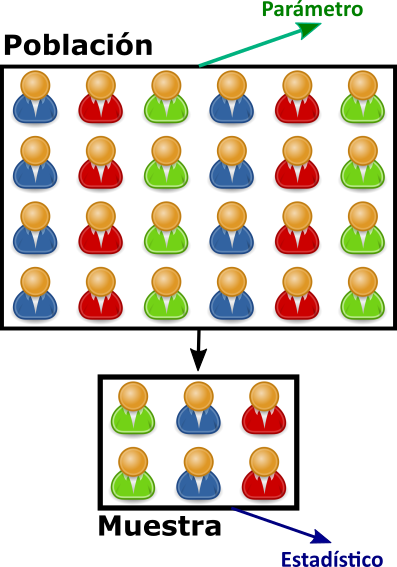
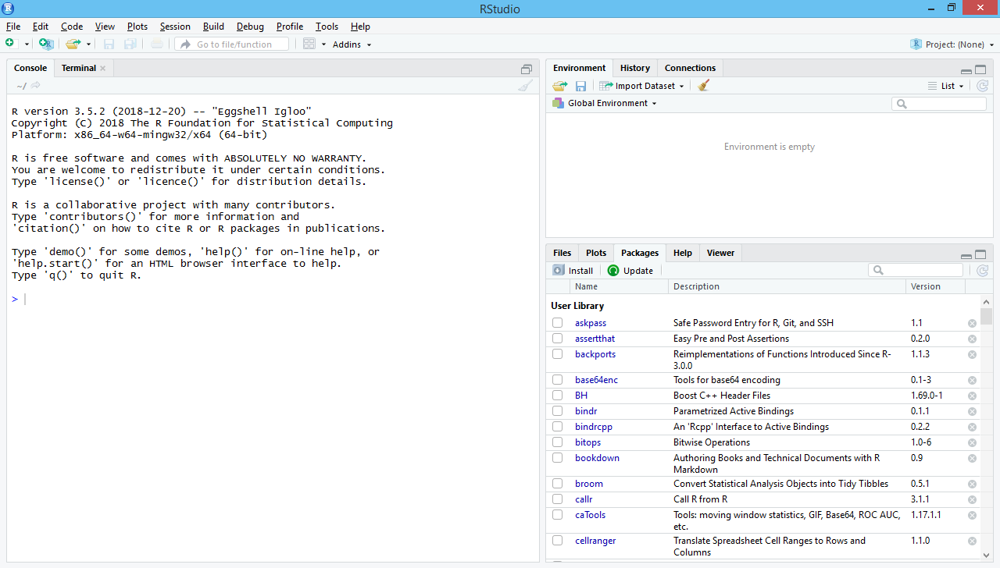
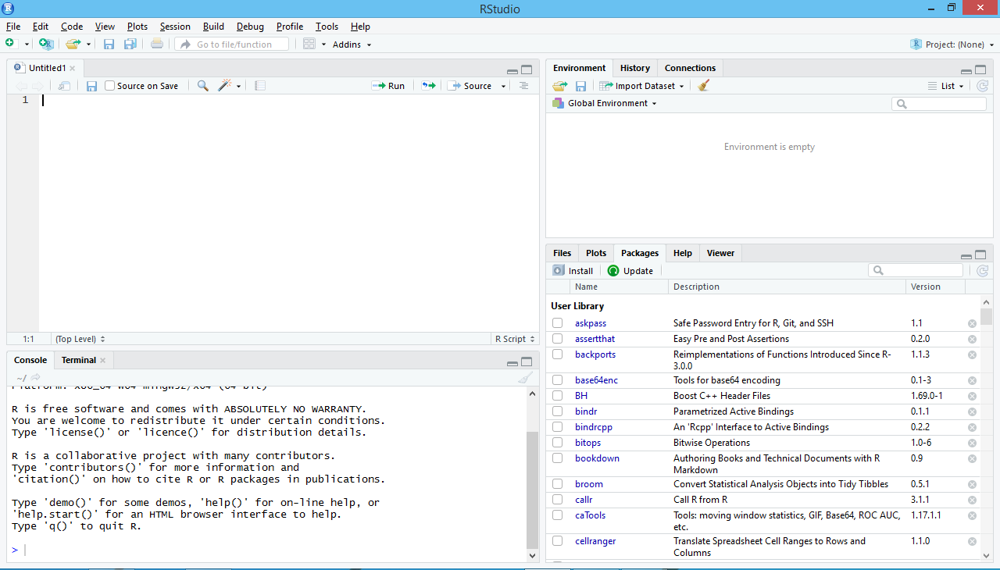
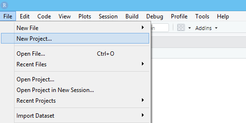
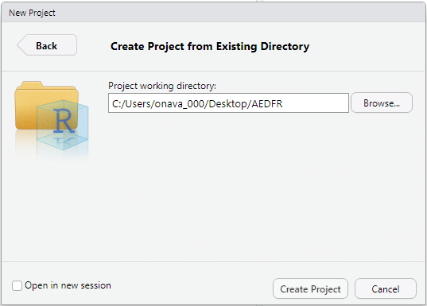
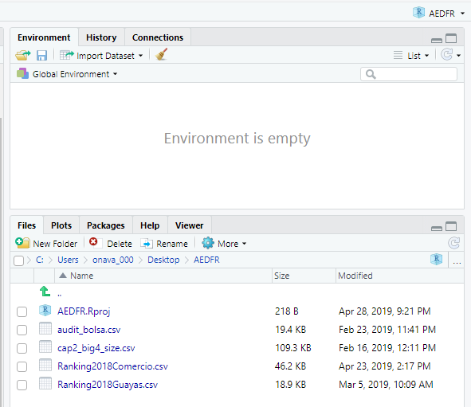
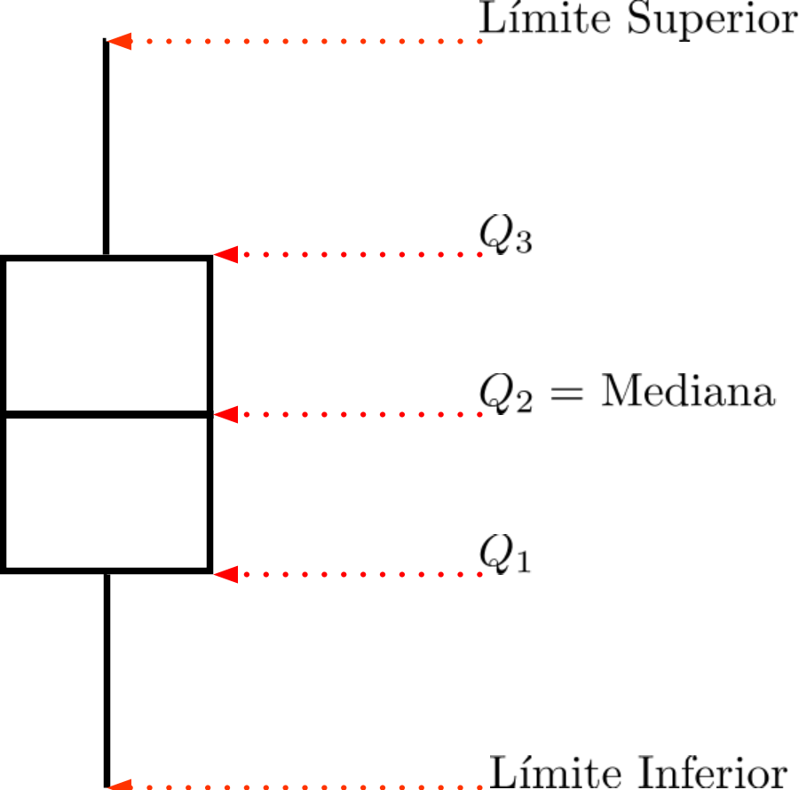

```{r include = FALSE}
if(!knitr:::is_html_output())
{
  knitr::opts_chunk$set(fig.pos = 'h!')
}
```


# Introducción {#intro}

En nuestra vida diaria es común escuchar el término **estadística** en situaciones como las tasas de desempleo, el índice de pobreza, el saldo promedio de nuestra cuenta de ahorros, el número de goles realizados en la LigaPro durante el fin de semana, etc. Aunque los ejemplos descritos no corresponden a una forma incorrecta de ver las estadísticas, en este texto se pensará a la estadística como un conjunto de métodos que se utilizan para **recoger, clasificar, resumir, organizar, presentar, analizar e interpretar información numérica**.

Otros autores manifiestan que "la estadística es la ciencia de diseñar estudios o experimentos, recoger datos y modelar o analizar los datos con el propósito de tomar decisiones o realizar descubrimientos científicos cuando la información disponible es tanto limitada como variable. Es decir que la estadística es la ciencia de *aprender de los datos*". 

En las empresas la estadística es usada para tomar decisiones como los productos y las cantidades que deben ser producidas, la frecuencia con la que una maquinaria debe recibir mantenimiento, el tamaño del inventario, la forma de distribuir los productos, y casi todos los aspectos relativos a sus operaciones. En el estudio de las finanzas, la contabilidad, la economía y otras ciencias sociales la motivación para usar estadística radica en entender como funcionan los sistemas económicos, financieros o contables. 

 
## Estadística descriptiva e inferencial {#estypes}

El uso de la estadística puede ser de dos formas. La primera, cuando se describen y se presentan los datos. Y la segunda es cuando los datos son utilizados para hacer inferencias sobre características del ambiente o entorno de donde se seleccionaron los datos o sobre el mecanismo subyacente que generó los datos. La primera forma recibe el nombre de __estadística descriptiva__ y la segunda se conoce como __estadística inferencial__

En la estadística descriptiva se utilizan métodos numéricos y gráficos para encontrar patrones y características de los datos a fin de resumir la información y presentarla de una forma significativa. Mientras que en la estadística inferencial se utilizan los datos para tomar decisiones, hacer estimaciones, pronósticos o predicciones y generalizaciones sobre el entorno del que fueron obtenidos los datos o el proceso que los generó.

Sea en estadística descriptiva o en estadística inferencial, el primer paso siempre va a ser obtener información de alguna característica, medida o valor que nos interese de un grupo de elementos. Esa característica, medida o valor de interés para el investigador recibe el nombre de **variable**. 

## Tipos de Variables

Muchos autores presentan algunas clasificaciones para las variables, sin embargo vamos a trabajar con una clasificación que se ajusta a las necesidades de la investigación en las áreas de nuestro interés. Según esta clasificación hay dos grandes grupos de variables: cuantitativas y cualitativas. Las primeras son las que toman valores __numéricos__. Mientras que las cualitativas toman valores que describen una __cualidad__ o __categoría__.

Las variables cuantitativas se clasifican a la vez en **continuas** que se presentan cuando las observaciones pueden tomar cualquier valor dentro de un subconjunto de los números reales, ejemplos de variables cuantitativas continuas son: edad, altura, temperatura y  peso. Las  **discretas** son aquellas cuya característica principal es que las observaciones pueden tomar un valor basado en un recuento de un conjunto de valores enteros distintos. Ejemplos de variables cuantitativas discretas son: número de hijos, número de comprobantes de venta emitidos en un mes, número de clientes haciendo fila durante una hora en un banco, etc.

### Niveles de medición

Las variables tienen cualquiera de los siguientes niveles de medición: 

1. Ordinal
2. Nominal
3. Intervalo
4. Razón

En el nivel  ordinal las observaciones toman valores que se ordenan o clasifican de forma lógica, por ejemplo las tallas de ropa (pequeña, media, grande, extra grande), la frecuencia con la que se hace una actividad (nunca, casi nunca, a veces, casi siempre, siempre). Por otro lado, en el nivel nominal las observaciones toman valores que no se pueden organizar de forna lógica, por ejemplo el sexo, el color de ojos, la marca de ropa favorita. Si se usan números en variables con nivel de medición nominal, estos números son usados solo para clasificar.

En el nivel de intervalo existe diferencia significativa entre valores pero el cero no representa la ausencia de la característica un ejemplo es la temperatura medida en grados Farenheit, el nivel de intervalo no solo clasifica y ordena las mediciones además indica que las distancias entre cada intervalo en la escala son equivalentes. Finalmente en el nivel de razón el 0 es significativo y la razón entre dos números es significativa, un ejemplo es la temperatura medida en grados Kelvin.

## Otros conceptos importantes

Existen algunos conceptos que son importantes y que se deben conocer al momento de realizar análisis estadístico de datos. 

*  **Población**: una población es el conjunto de todos los sujetos u objetos de interés en una investigación o análisis. Por ejemplo si se desea analizar la intención de voto en una ciudad para las próximas elecciones seccionales, la población serían todas las personas en edad de votar empadronadas en la ciudad. 
* **Muestra**: es la parte de la población que es analizada. Sigamos con el ejemplo de la intención de voto, aunque el investigador quisiera no puede acceder a toda la población ya sea por cuestiones de tiempo o dinero y por esta razón debe tomar una parte de la población. La muestra debe representar lo mejor posible a  la población. La parte de la estadística que comprende los métodos estadísticos para obtener muestras representativas de una población se llama *muestreo*
* **Parámetro**: un parámetro es una cantidad numérica que caracteriza a una población.
* **Estadístico**: un estadístico es una cantidad numérica que caracteriza a una muestra. 

```{r popsample, out.width = "50%",fig.cap="Población, Muestra, Parámetro y Estadístico",fig.align = 'center', echo=FALSE,fig.pos='h!'}


```

## Primeros pasos en R {#primerR}

Una vez instalado R y RStudio, abrimos Rstudio para comenzar a trabajar. La ventana de RStudio tiene la apariencia que se muestra en la figura \@ref(fig:rstudio1).

```{r rstudio1, out.width = "50%",fig.cap="Ventana de RStudio",fig.align = 'center', echo=FALSE,fig.pos='h!'}


```

Lo primero que debemos hacer es abrir un nuevo "script", un script de R es simplemente un archivo de texto que contiene (casi) todos los comandos que se escribirían en la línea de comandos de R, para esto en la barra de menú seguimos la secuencia __File, New File, R Script__ o desde el teclado con la combinación _Ctrl + Shift + N_, en este archivo iremos escribiendo todos los comandos que vamos a trabajar. En la figura \@ref(fig:rstudio2) se aprecia un script abierto.

```{r rstudio2, out.width = "50%",fig.cap="Ventana de RStudio con Script",fig.align = 'center', echo=FALSE,fig.pos='h!'}



```

Para empezar a aprender, en el script vamos a escribir `3+2` y ejecutamos esto con la combinación de teclas __Ctrl + Enter__ el resultado obviamente es `r 3+2`. Ahora ingresaremos un conjunto de valores y los almacenaremos en una variable, para almacenar algo en una variable se puede usar  `<-` o  `=`. 

En el código que se muestra a continuación en la variable `x` almacenaremos un conjunto de 8 observaciones, es importante observar que la lista de datos es ingresada con el comando `c(elem1,elem2,elem3,...)` si los elementos de la lista fueran cadenas de texto o caracteres cada elemento se encierra entre comillas `" "`: 

```{r results='hide'}
x <- c(3,7,9,5,6,2,1,10) 
```

 Recuerde que este código se ejecuta con la combinación de teclas __Ctrl + Enter__. Para poder realizar análisis estadístico, es necesario cargar nuestros datos en el programa. R acepta algunos formatos de archivos, como por ejemplo archivos de Excel, archivos de valores separados por coma, archivos de texto e inclusive archivos de otros programas como SPSS. Lo más usual es trabajar con archvo de valores separados por coma es decir con extensión `.csv`, estos archivos `csv` se generan cuando el investigador recolecta la información, la almacena en un archivo de Excel o alguna otra hoja de cálculo y la guarda como un archivo de valores separados por coma. 

Para trabajar de forma eficiente con R existen dos formas la primera es fijar un directorio de trabajo y la segunda es crear un proyecto. Un directorio de trabajo es el espacio donde deben estar guardados nuestros archivos en el formato que sea de nuestra preferencia. Una forma de fijar el directorio de trabajo es desde la barra de menú escoger las opciones __Session, Set Working Directory, Choose Directory__ o desde el teclado con la combinación __Ctrl+Shift+H__, o con la función `setwd("rutadelarchivo")`. 
Sin embargo la mejor forma de trabajar, por la experiencia de los autores, es crear un proyecto. Para crear un proyecto primero debemos presionar __File, New Project__ como se ve en la figura \@ref(fig:project1)

```{r project1, out.width = "45%",fig.cap="Nuevo Proyecto. Paso 1",fig.align = 'center', echo=FALSE,fig.pos='!h'}



```

Si no hemos creado la carpeta donde reposarán nuestros archivos, escogemos la primera opción __New Directory__. Pero si los archivos a ser analizados ya están en una carpeta escogemos la segunda opción __Existing Directory__, en este caso ya tenemos los archivos en una carpeta llamada _AEDFR_ por lo que escogemos la segunda opción. Las opciones se aprecian en la figura \@ref(fig:project2)

```{r project2, out.width = "45%",fig.cap="Nuevo Proyecto. Paso 2",fig.align = 'center', echo=FALSE,fig.pos='!h'}

knitr::include_graphics("project2.png")
```

Luego escogemos la ubicación de la carpeta donde reposan nuestros archivos dando clic en el botón __Browse__. Finalmente escogemos __Create Project__ como se aprecia en la figura \@ref(fig:project3).

```{r project3, out.width = "45%",fig.cap="Nuevo Proyecto. Paso 3",fig.align = 'center', echo=FALSE,fig.pos='!h'}



```

Finalmente se crea nuestro proyecto, la ventana de Rstudio ahora en la parte superior derecha muestra el nombre de nuestro proyecto. Tal como se aprecia en la figura \@ref(fig:project4)

```{r project4, out.width = "40%",fig.cap="Nuevo Proyecto. Paso Final",fig.align = 'center', echo=FALSE,fig.pos='!h'}



```

\newpage 

En este primer ejercicio trabajaremos con el archivo *cap2_big4_size.csv*. Los datos serán guardados en una variable llamada `big4size`, usaremos la función  `read.csv()` para leer los datos. La función `read.csv()` recibe las instrucciones `read.csv("archivo", header=T, sep=";",dec=",")`.  La opción `"archivo"` indica el nombre del archivo, `header=T` o `header=F` permite indicar si las columnas tienen o no un encabezado que las identifique, `sep=";"` sirve para indicar cual es el separador presente en nuestro archivo en algunas ocasiones ocurre que un archivo de valores separado por coma en realidad tiene sus valores separados por un punto y cona esto generalmente ocurre cuando el sistema operativo utiliza, como en este caso, la coma como separador decimal y finalmente la opción `dec=","` sirve para indicar que el separador decimal es la coma. 

En R se puede acceder a la ayuda sobre las funciones, esto se hace escribiendo `?funcion` por ejemplo si queremos la ayuda de la función `read.csv` simplemente escribimos `?read.csv` en el panel ubicado en la parte inferior derecha se desplegará la ayuda de la función. Con la particularidad de que la ayuda se despliega en inglés lo que no debería ser problema para un buen investigador.

El archivo que vamos a analizar contiene los activos, la utilidad, las ventas y el patrimonio de una muestra de empresas tomada de los registros de la Superintendencia de Compañías. Además en el conjunto de datos se indica si la empresa ha sido auditada por una de las 4 firmas auditoras consideradas las más grandes o también llamadas _*Big Four*_. En la \@ref(tab:tabla1) se muestran las 10 primeras observaciones de nuestro conjunto de datos.


```{r tabla1, echo=FALSE}
big4size <- read.csv("cap2_big4_size.csv",header=TRUE,sep=";",dec=",")
knitr::kable(
  head(big4size, 10), caption = 'Primeras 10 observaciones', longtable = TRUE,
  booktabs = TRUE,format = "pandoc") 
```

\newpage

Sin más preámbulos, empecemos a trabajar. Recapitulando nuestro flujo de trabajo es:

1. Configurar el directorio de trabajo o crear un proyecto. Este paso ya fue realizado.
2. Cargar el archivo indicado.
3.  Finalmente usamos la función `str()`, que nos permite obtener la descripción de la estructura de los datos. 

```{r}
big4size <- read.csv("cap2_big4_size.csv",header=TRUE,sep=";",dec=",")
str(big4size)
```


En la primera línea de los resultados se observa la salida  `'data.frame': 2256 obs. of  6 variables:` esto nos indica que nuestro *marco de datos (data frame)* tiene 2256 observaciones y 6 variables. Con respecto a las variables tenemos 6 variables que a continuación se describen y se explican los resultados obtenidos con la función.

* `EXPMUESTRA`: esta variable es de tipo entera `(INT)` (por el inglés *integer*) y almacena el expediente de la empresa. Aunque la variable tiene valores numéricos, no es una variable cuantitativa sino cualitativa "Expediente de la Empresa"
* `BIG4`: esta variable es de tipo entera, y ha sido codificada con 1 si la empresa fue auditada por una Big Four y 0 si no. Podemos cambiar esta codificación por "Sí" y "No" en lugar de "1" y "0", más adelante aprenderemos como hacerlo. Al igual que la variable anterior aunque tiene valores numéricos, no es una variable cuantitativa sino cualitativa, dejamos al lector la reflexión en este particular. 
* `ACTIVOS`: contiene el valor de los activos totales de la empresa. Es de tipo `NUM` es decir una variable cuantitativa continua porque permite el uso de decimales. 
* `UTILIDAD`: contiene el valor de la utildad de la empresa.
* `VTAS`: contiene el valor de las ventas de la empresa.
* `PAT`: contiene el valor del patrimonio de la empresa.

Los paquetes de R son colecciones de funciones y conjuntos de datos desarrollados por la comunidad de usuarios, los paquetes aumentan el poder de R mejorando las funcionalidades existentes en la base de R, o añadiendo nuevas funcionalidades. En este texto trabajaremos con algunos de los paquetes desarrollados por el equipo de RStudio como `ggplot2`, `dplyr` y otros, una descripción detallada de estos paquetes puede ser encontrada en  <https://www.rstudio.com/products/rpackages/>. Trabajaremos también con paquetes desarrollados por otros colaboradores de la comunidad de usuarios de R. 

Comenzaremos por instalar el paquete `dplyr`, este paquete tiene funciones que permiten realizar facilmente manipulaciones de datos. Para instalar un paquete se utiliza la función `install.packages("paquete")`. Una vez instalado el paquete, se carga el paquete utilizando la función `library(paquete)`.

```{r, eval=FALSE}
install.packages("dplyr")
```

La primera manipulación que vamos a realizar es la creación de nuevas variables con el paquete `dplyr`. En nuestros datos cargados en el conjunto de datos `big4size` vamos a crear tres variables nuevas __ROA__, __ROS__ y __ROE__. Recordemos que el __Retorno sobre activos__ ( __ROA__, Return on Assets) se lo calcula como la razón entre la utilidad y los activos como se ve en la ecuación \@ref(eq:roa). En las ecuaciones \@ref(eq:ros) y \@ref(eq:roe) se dan las expresiones para calcular el __Retorno sobre ventas__ ( __ROS__ Return on Sales) y el __Retorno sobre el Patrimonio__ ( __ROE__ Return on Equity)

\begin{equation} 
  ROA = \dfrac{Utilidad}{Activos}
  (\#eq:roa)
\end{equation} 

\begin{equation} 
  ROS = \dfrac{Utilidad}{Ventas}
  (\#eq:ros)
\end{equation}

\begin{equation} 
  ROE = \dfrac{Utilidad}{Patrimonio}
  (\#eq:roe)
\end{equation}

Una característica importante de `dplyr` es el uso del operador `%>%`. Cada transformación u operación en los datos se separa por el operador `%>%`. La primera función de `dplyr` que usaremos es `mutate()`, básicamente esta función permite crear nuevas variables.

```{r}
library(dplyr)
big4size <- big4size %>%
  mutate(
    ROA = UTILIDAD/ACTIVOS,
    ROS = UTILIDAD/VTAS,
    ROE = UTILIDAD/PAT
  )
str(big4size)
```

En las últimas líneas de la salida de R, se observa que ahora en el conjunto de datos existen tres nuevas variables. En la próxima sección seguiremos trabajando con el mismo conjunto de datos.

\newpage

## Medidas de Tendencia Central {#tendcentr}

Una medida de tendencia central, es una medida de resumen que intenta describir un conjunto completo de datos con un único valor que representa la mitad o centro de la distribución. 

Las tres medidas de tendencia central principales son la media la mediana y la moda.

### Media

La media se la calcula como la suma de todos los valores de una variable dividido para el número de valores. En la ecuación \@ref(eq:mean) se muestra la fórmula para calcular la media.

\begin{equation} 
  \bar{x} = \dfrac{\sum_{i=1}^{n}x_i}{n}
  (\#eq:mean)
\end{equation}

La expresión $\sum_{i=1}^{n} x_i$ se interpreta como la suma desde el primer hasta el último elemento del conjunto de datos, es decir:

\begin{equation} 
  \sum_{i=1}^{n} x_i = x_1 + x_2 + \ldots + x_n 
  (\#eq:sum)
\end{equation}

La media tiene algunas propiedades que a continuación se detallan:

* Si a cada valor $x_i$ de una distribución con media $\bar{x}$ se le suma un valor constante $k \in \mathbb{R}$, la nueva media es $\bar{x}+k$.
* Si a cada valor $x_i$ de una distribución con media $\bar{x}$ se lo multiplica por un valor constante $k \in \mathbb{R}$, la nueva media es $k\bar{x}$.
* Si a cada valor $x_i$ de una distribución con media $\bar{x}$ se lo divide por un valor constante $k \neq 0 \in \mathbb{R}$, la nueva media es $\dfrac{\bar{x}}{k}$.
* Solo existe una media para un conjunto de datos.
* Las medias de subconjuntos de un conjunto de datos pueden ser combinadas para determinar la media del conjunto de datos completo.
* Solo se usa para datos cuantitativos.

Las ventajas de usar la media son:

* Es fácil de entender y calcular
* No se ve afectada mayormente por fluctuaciones productos del muestreo
* Toma en cuenta todos los valores de la variable

Las desventajas de usar la media son:

* Es muy sensible a la presencia de pocos valores muy pequeños o muy grandes, dicho de otra forma la media es sensible a valores aberrantes o extremos.
* No se puede calcular por inspección.


### Mediana

La mediana es el valor central en una distribución cuando se ordenan los valores de forma ascendente o descendente. El valor de la mediana depende entonces del número de valores presentes en la variable. Definamos como $\left\{ X \right \}$ al conjunto ordenado de datos, y sea $\left  \{ X \right \}_i$ el valor i-ésimo del conjunto $\left \{ X \right \}$ entonces la mediana $Me$ se define como

\begin{equation}
Me = \begin{cases} 
      \left \{ X \right\}_{\frac{n+1}{2}} & ; n \quad \textrm{impar}  \\
      \dfrac{\left \{ X  \right \}_{\frac{n}{2}} + \left \{ X  \right \}_{\frac{n}{2}+1} }{2} & ; n \quad \textrm{par}
   \end{cases}
   (\#eq:median)
\end{equation}

Lo escrito en la ecuación \@ref(eq:median) se puede expresar de la siguiente forma: si el número de datos es impar, la mediana es igual al valor central de la distribución y si el número de datos es par, la mediana es igual al promedio de los valores centrales de la distribución.

Las ventajas de usar la mediana son:

* Es fácil de calcular y comprender
* Solo existe una mediana para un conjunto de datos. 
* No se ve afectada por valores extremos
* Se puede determinar para escalas ordinales, nominales, de razón e intervalo

Las desventajas de usar la mediana son:

* No toma en cuenta el valor exacto de cada dato y por tanto no usa toda la información disponible.
* Si se agrupan los valores de dos grupos, la mediana de cada grupo no puede ser expresada en términos del grupo agrupado. Dicho de otra forma si se calculan las medianas de subconjuntos de un conjunto de datos, estas medianas no pueden ser combinadas para calcular la mediana de todo el conjunto 


### Moda

La moda es definida como el valor que ocurre con mayor frecuencia en los datos. Algunos conjuntos de datos no tienen moda porque cada valor ocurre solo una vez. Hay conjuntos de datos que tienen más de una moda, si tienen 2 modas reciben el nombre de bimodal y se acostumbra que si tiene más de 3 modas se la llama multimodal.

Las ventajas de usar la moda son:

* Puede ser usada para datos con escala nominal
* Es sencilla de calcular

La desventaja de la moda es:

* No es usada en análisis estadístico debido a que no está definida algebraicamente y la fluctuación en la frecuencia de las observaciones es mayor cuando el tamaño de la muestra es pequeña.

### ¿Trabajamos con la media o la mediana?

La media es considerada generalmente la mejor medida de tendencia central y la más usada. Sin embargo, hay situaciones donde las otras medidas de tendencia central son preferidas. 

La mediana es preferida a la media cuando:

* Hay valores extremos en la distribución
* Hay valores indeterminados
* Los datos son medidos en una escala ordinal

La moda es la medida preferida cuando los datos son medidos en una escala nominal. 

### Cálculo de las medidas de tendencia central en R

Para calcular la media y la mediana se utilizan las funciones  `mean()` y `median()` respectivamente, estas dos funciones vienen cargadas con los paquetes base de R. Para calcular la moda usaremos la función `Mode()` del paquete `DescTools`, recuerde que para instalar un paquete se utiliza la función `install.packages()`.

En el siguiente ejemplo se obtiene la media de los activos de las empresas. Puesto que solamente necesitamos una variable del conjunto de datos usamos el operador `$`, el funcionamiento de este operador es `data.frame$variable` es decir indicamos el conjunto de datos del que llamamos la variable y después del operador `$` indicamos la variable que vamos a trabajar.

```{r, results='markup'}
mean(big4size$ACTIVOS)
median(big4size$ACTIVOS)
library(DescTools)
Mode(big4size$ACTIVOS)
```

En el resultado de la moda se obtienen 2 valores. Es decir que existen dos valores que se repiten más veces o tienen mayor frecuencia. Cuando se realiza investigación es común desear hacer una tabla con las estadísticas descriptivas de los datos. El paquete `dplyr` permite realizar tablas que resuman las variables de forma sencilla con la función `summarise()`.

```{r, results='markup'}
big4size %>%
  summarise(PROM.ACTIVOS = mean(ACTIVOS),
            PROM.UTILIDAD = mean(UTILIDAD),
            PROM.VTAS = mean(VTAS),
            MEDIAN.ACTIVOS = median(ACTIVOS),
            MEDIAN.UTILIDAD = median(UTILIDAD),
            MEDIAN.VTAS = median(VTAS)
            )
```

#### ¿Cuándo usar `mutate()` y cuándo usar `summarise()`? 
 
Note que cuando usamos la función `summarise()` creamos nuevas variables en el conjunto de datos, al igual que cuando se usa la función `mutate()` la principal diferencia entre `summarise()`y `mutate()` es que la primera resume los datos es decir devuelve un nuevo conjunto de datos con menos filas, mientras que `mutate()` devuelve el conjunto de datos con el mismo número de observaciones es decir con el mismo número de filas.

## Medidas de posición (Cuantiles)

Las medidas de posición no central permiten conocer otros puntos característicos de la distribución que no son los valores centrales. Entre las medidas de posición no central más importantes están los cuantiles. El término cuantil fue usado por primera vez por Kendall en 1940.

El cuantil de orden $p$ de una distribución con $0<p<1$ es el valor $x_{i}$ de la variable $X$ que marca un corte de modo que una proporción $p$ o un porcentaje $100p$% de valores de la población es menor o igual que $x_{i}$ Por ejemplo el cuantil de orden $0.35$ dejaría un 35% de valores por debajo de él. 

### Tipos de Cuantiles

- *Cuartiles*: son 3 valores ($Q_{1}, Q_{2}, Q_{3}$) que dividen a la distribución en 4 partes iguales.

```{r cuart, out.width = "50%",fig.cap="Cuartiles",fig.align = 'center', echo=FALSE,fig.pos='!h'}


```

- *Quintiles*: son 4 valores ($K_{1}, K_{2}, K_{3}, K_{4}$) que dividen a la distribución en 5 partes iguales.

```{r quint, out.width = "50%",fig.cap="Quintiles",fig.align = 'center', echo=FALSE,fig.pos='!h'}


```

- *Deciles*: son 9 valores ($D_1, D_2, D_3, D_4, D_5, D_6, D_7, D_8, D_9$) que dividen a la distribución en 10 partes iguales.

```{r decil, out.width = "50%",fig.cap="Deciles",fig.align = 'center', echo=FALSE,fig.pos='!h'}


```

- *Percentiles*, son 99 valores ($P_1, P_2, \ldots P_{99}$) que dividen a la distribución en 100 partes iguales.


### Cálculo de cuantiles

Es fácil darse cuenta que existen equivalencias importantes entre los cuantiles, algunos ejemplos de estas equivalencias:

- $D_5=Q_2=P_{50}$
- $D_4=K_2=P_{40}$
- $D_3=P_{30}$

Se deduce entonces que  no es necesario tener una expresión para cada tipo de cuantiles, basta con conocer una expresión para calcular percentiles. Para esto debemos conocer dos cosas:

1. La posición del percentil en nuestro conjunto de datos.
2. El valor del percentil tomando en cuenta su posición.

Para calcular la posición del percentil $i$ que acumula el 100$p$% en un conjunto de datos no agrupado $X$, de tamaño $n$ y ordenado en forma ascendente primero determinamos la posición del percentil con la expresión:

\begin{equation} 
  \text{Posición} = p(n-1)+1
  (\#eq:posperc)
\end{equation} 

Para determinar el valor $X_{i.a}$ utilizamos la expresión:

\begin{equation} 
  X_{i.a}=X_{i}+0.a(X_{i+1}-X_{i})
  (\#eq:valperc)
\end{equation} 

Para calcular percentiles en R, se utiliza la función `quantile()`. Esta función recibe dos argumentos, la variable de la que se calcula el percentil y el porcentaje del percentil que se desea calcular. Se pueden calcular varios percentiles al mismo tiempo. 

Vamos a calcular el primer cuartil $Q_{1}$ de la variable `ACTIVOS` del conjunto de datos ya trabajado anteriormente. Vamos a llamar a esta variable utilizando la notación `$` recordemos que esta notación se usa poniendo `data.frame$variable` en este caso nuestra variable está en el conjunto `big4size` y se llama `ACTIVOS` por lo que para llamar la variable desde la función escribimos `big4size$ACTIVOS`. Luego debemos recordar que $Q_1=P_{25}$ es decir que en la función `quantile` debemos anotar $0.25$

```{r echo=TRUE}
quantile(big4size$ACTIVOS, 0.25)
```

Ahora calculamos los tres cuartiles en este caso podemos escribir dentro de una lista los tres valores, para ingresar listas en R lo hacemos con `c(elemento1, elemento2, ... )` como ya lo habíamos indicado antes.

```{r, echo=TRUE}
quantile(big4size$ACTIVOS, c(0.25,0.50,0.75))
```

De los resultados obtenidos se interpreta que el 25% de los activos de las empresas es menor que $3\;184\;669$. Supongamos que se quieren determinar los deciles, una forma de hacer la lista es con la función `seq` con las instrucciones `seq(inicial, final, by = aumento)` de esta manera evitamos escribir los nueve valores.

```{r, echo=TRUE}
quantile(big4size$ACTIVOS, seq(0.1,0.9, by = 0.1))
```

\newpage

## Medidas de dispersión {#dispersion}

Si comparamos los conjuntos de datos $X=\left\{ 2,4,6,8 \right\}$ y $Y=\left\{1,3,7,9\right\}$ se obtiene que las medias son iguales $\bar{X}= \bar{Y}=5$. En la figura \@ref(fig:rnl1) se han graficado con color rojo los puntos del conjunto $X$ y de color celeste los puntos del conjunto $Y$. Se observa que los valores del conjunto $Y$ están más dispersos que los valores del conjunto $X$, es fácil observar que los valores del conjunto $X$ están más cercanos a la media. En esta sección se discute las formas existentes para cuantificar la dispersión.

```{r rnl1, out.width = "50%",fig.cap="Conjuntos graficados",fig.align = 'center', echo=FALSE}
CONJUNTO = c(rep("X",4),rep("Y",4))
valores = c(2,4,6,8,1,3,7,9)
datos = valores
datos = as.data.frame(datos)
datos =cbind(CONJUNTO, datos)


ggplot(datos, aes(x=valores,y=CONJUNTO)) + 
  geom_point(aes(col=CONJUNTO,size=2)) +
  scale_x_continuous(breaks=1:9) +
  geom_vline(xintercept=5, linetype="dashed") +
  theme(legend.position = "none",panel.background = element_rect(fill="white"))+
  ylab("") + xlab("") 
```

### Rango
El rango es la medida de dispersión más fácil de calcular. Se obtiene restando el máximo menos el mínimo. La expresión para calcularlo es:

\begin{equation} 
  Rango = max - min
  (\#eq:rg)
\end{equation}

### Varianza

La dispersión  en un conjunto $x$ se puede entender como una medida de la distancia que tiene cada dato $x_i$ a la media de los datos. En el caso del conjunto $X$ descrito al inicio de esta sección se puede verificar que para cada dato la distancia del dato a la media ($x_i-\bar{x}$) es:

* $2-5=-3$
* $4-5=-1$
* $6-5=1$
* $8-5=3$

Sin embargo si sumamos estos valores el resultado es  $0$. De hecho el lector puede verificar que para cualquier conjunto de datos $X$ se cumple que $\sum_{i=1}^n{\left(x_i-\bar{x}\right)}=0$ por esta razón para calcular la dispersión se trabaja con la distancia cuadrática $\left(x_i-\bar{x}\right)^2$.

La varianza es el promedio de la diferencia de la media cuadrática. Si se conocen todos los datos de una población se puede calcular la varianza poblacional, denotada con $\sigma^2$, con la expresión:

\begin{equation} 
  \sigma^2 = \dfrac{\sum_{i=1}^{N}\left(x_i- \mu \right)^2}{N}
  (\#eq:varp)
\end{equation}

Por otro lado si se conocen los datos de una muestra se puede calcular la varianza muestral, denotada con $s^2$, con la expresión:

\begin{equation} 
  s^2 = \dfrac{\sum_{i=1}^{n}\left(x_i - \bar{x} \right)^2}{n-1}
  (\#eq:varm)
\end{equation}


### Desviación

La desviación es la raíz cuadrada de la varianza, en las fórmulas \@ref(eq:desp) y \@ref(eq:desm) se muestran las expresiones para calcular la desviación poblacional y muestral respectivamente. 

\begin{equation} 
  \sigma = \sqrt{\sigma^2} = \sqrt{\dfrac{\sum_{i=1}^{N}\left(x_i- \mu \right)^2}{N}}
  (\#eq:desp)
\end{equation}

\begin{equation} 
  s = \sqrt{s^2} = \sqrt{\dfrac{\sum_{i=1}^{n}\left(x_i- \bar{x} \right)^2}{n-1}}
  (\#eq:desm)
\end{equation}

### Medidas de dispersión en R 

Es necesario saber que R por defecto no tiene una función para calcular el rango sin embargo para calcular el rango vamos a usar `max() - min()`, y que además por defecto R tiene una función para calcular la varianza muestral (`var()`) y otra para calcular la desviación muestral (`sd()`), si se desea obtener la varianza y la desviación poblacional existen por lo menos 3 soluciones:

* Se puede multiplicar la varianza muestral por $\dfrac{n-1}{n}$ para obtener la varianza poblacional y la desviación muestral por $\sqrt{\dfrac{n-1}{n}}$ para obtener la desviación poblacional.
* Se puede multiplicar la varianza muestral por $\dfrac{n-1}{n}$ para obtener la varianza poblacional y a ese resultado extraer la raíz cuadrada para obtener la desviación poblacional.
* Crear funciones propias que calculen la varianza y la desviación muestral. 

Vamos a trabajar con la segunda solución que es simplemente una mejora de la primera solución, la tercera solución es avanzada y será abordada más adelante.

A manera de ejemplo vamos a calcular las medidas de dispersión de los activos en millones de dólares de la base `cap2_big4_size.csv`. Se calculan la varianza y la desviación poblacional aunque, a menos de que tengamos todos los datos (población), siempre en el análisis estadístico de datos se calcula la varianza y la desviación muestral.

```{r, results='markup'}
big4size %>%
  summarise(RANGO.ACTIVOS = max(ACTIVOS/1000000)-min(ACTIVOS/1000000),
            VARM.ACTIVOS = var(ACTIVOS/1000000),
            DESVM.ACTIVOS = sd(ACTIVOS/1000000),
            n=n()
            ) %>%
  mutate(VARP.ACTIVOS = VARM.ACTIVOS*((n-1)/n),
         DESVP.ACTIVOS = sqrt(VARP.ACTIVOS)) %>%
  select(RANGO.ACTIVOS, VARM.ACTIVOS, DESVM.ACTIVOS, VARP.ACTIVOS, DESVP.ACTIVOS)
```

## Tablas de frecuencia

Una tabla de frecuencia es una forma de describir los datos de forma resumida, las tablas de frecuencia pueden construirse para variables cualitativas y para variables cuantitativas.

### Variables Cualitativas

Para las variables cualitativas una tabla de frecuencia basicámente tiene tres columnas: "Categoría", "Frecuencia", "Porcentaje". Para aprender a realizar tablas de frecuencia para variables cualitativas, trabajaremos con el conjunto de datos `audit_bolsa`, Este conjunto de datos tiene información sobre las empresas que cotizan en la Bolsa de Valores de Guayaquil, se elaborará una tabla de frecuencias de las firmas auditoras que han trabajado para estas empresas. La variable en la que se almacena esta información es la variable `FIRMA`. La tabla de frecuencia se elabora usando el paquete  `dplyr`. Recordemos que la función `mutate( )` sirve para crear nuevas columnas, en este caso se crea la columna porcentaje. 


```{r , echo=TRUE,eval=FALSE}
audit_bolsa <- read.csv("audit_bolsa.csv",header=TRUE,sep=";",dec=",")

tabla_firma <- audit_bolsa %>%
  group_by(FIRMA) %>%
  summarise(Frecuencia=n()) %>%
  mutate(Porcentaje = round(100*Frecuencia/sum(Frecuencia),2)
         ) %>%
  arrange(desc(Porcentaje))
 print(tabla_firma)
```

```{r , echo=FALSE,eval=TRUE, results='markup'}
audit_bolsa <- read.csv("audit_bolsa.csv",header=TRUE,sep=";",dec=",")

tabla_firma <- audit_bolsa %>%
  group_by(FIRMA) %>%
  summarise(Frecuencia=n()) %>%
  mutate(Porcentaje = round(100*Frecuencia/sum(Frecuencia),2)
         ) %>%
  arrange(desc(Porcentaje))
 print(tabla_firma)
```

```{r tabla2, echo=FALSE}
knitr::kable(
  tabla_firma, caption = 'Tabla de Frecuencia de Firmas Auditoras',
  booktabs = TRUE,format = "pandoc") 
```

En la tabla \@ref(tab:tabla2) se aprecia el resultado obtenido y formateado para ser publicado. El resultado de R, puede ser exportado a un archivo Excel con la finalidad de luego tomar esa tabla y llevarla a un documento donde se presentará toda la información analizada. Para exportar la información a un archivo excel se puede trabajar con el paquete `xlsx`. Para exportar los resultados a Excel se puede proceder de la siguiente forma.

1. Cargar el paquete `xlsx`.
2. Convertir el resultado a un `data frame` utilizando la función `as.data.frame()`
3. Exportar el resultado con la función `write.xlsx()` cuya estructura básica es `write.xlsx(datos, "archivo.xlsx")`, si se desea consultar más detalles de la función se puede escribir `?write.xlsx`. 

El resultado de esta operación será un archivo de excel guardado en nuestro directorio de trabajo.

```{r, echo=TRUE, eval=TRUE}
library(xlsx)
tabla_firma = as.data.frame(tabla_firma)
write.xlsx(tabla_firma, "tablas.xlsx", sheetName = "firmas", row.names = FALSE)

```

La opción `sheetname = "firmas"` crea dentro del libro `tablas.xlsx` una hoja de cálculo llamada `firmas`. La opción `row.names = FALSE` hace que en el archivo final no se graben los números de cada fila. 
 
Nota: es importante tener fijado el directorio de trabajo, como se explicó en la sección \@ref(primerR). 

### Variables Cuantitativas

Una tabla de frecuencias para variables cuantitativas tiene 6 columnas:

1. Clase: una clase es un intervalo del tipo $\left[ menor, mayor \right)$
2. Marca de Clase: es un valor igual al promedio de los dos extremos de la clase.
3. Frecuencia: la frecuencia es igual al número de valores de la variable que están dentro del intervalo.
4. Frecuencia relativa: la frecuencia relativa se la calcula como la frecuencia dividida para el total de valores de la variable.
5. Frecuencia acumulada: se la calcula sumando las frecuencias desde la primera clase hasta la clase en consideración.
6. Frecuencia Relativa acumulada: se la calcula como la frecuencia acumulada pero para las frecuencias relativas. 


Una de las ventajas de usar R es que se pueden crear funciones para cada necesidad que el investigador tenga, en este caso el código que se muestra sirve para hacer tablas de frecuencia de cualquier variable cuantitativa. A manera de ejemplo se hará la tabla de frecuencia de la variable `VTAS` en millones de dólares, del conjunto de datos trabajado en la sección \@ref(primerR). 

```{r,echo = TRUE}
library(agricolae)
library(dplyr)

h2<-with(big4size,graph.freq(VTAS/1000000,plot=FALSE));

h2 = table.freq(h2)

h3 <- h2 %>%
  mutate(Clase = paste("[",Lower,",",Upper,")"),	
        "Marca de Clase"  =  Main,
        Frec. = Frequency,
        "Frec. Rel." = Percentage,
        "Frec. Acu." = CF,
        "Rel. Acu." = CPF )  %>%
  select(-c(1:7))
```

```{r tabla3, echo=FALSE}
knitr::kable(
  h3, caption = 'Tabla de Frecuencia de las Ventas',
  booktabs = TRUE,format = "pandoc") 
```

De la tabla \@ref(tab:tabla3) se obsserva que el $93\%$ de las empresas realiza ventas entre 0 y $165.76$ millones. El $99\%$  de las empresas es decir $2234$ tiene ventas menores a $663.04$ millones de dólares, esto se lo puede ver en la columna de frecuencias acumuladas relativas. Además, solo una empresa tiene ventas entre $1823.36$ y $1989.12$ millones. Finalmente vamos a exportar la tabla de frecuencia en el archivo `tablas.xlsx`. La opción `append = TRUE` sirve para añadir una nueva hoja de cálculo al libro.

```{r, echo=TRUE, eval=TRUE}
library(xlsx)
h3 = as.data.frame(h3)
write.xlsx(h3, "tablas.xlsx", sheetName = "frec_ventas", row.names = FALSE,append=TRUE)
```

## Tablas de Contingencia

Una tabla de contingencia es una forma útil para examinar relaciones entre dos variables categóricas. Los valores en las celdas de una tabla de contingencia pueden ser de frecuencia absoluta o frecuencia relativa.

Para ejemplificar la construcción de una tabla de contingencia vamos a trabajar con el archivo `Ranking2018Guayas.csv` que tiene información sobre 23457 empresas de la provincia del Guayas. Se analizará la relación entre la ciudad y el tamaño de las empresas. 

```{r, echo=TRUE, eval=TRUE}
rank2018 = read.csv("Ranking2018Guayas.csv",header=TRUE, sep=";",dec=",")

ciudad.tama = rank2018 %>% 
  group_by(CIUDAD, TAMAÑO)%>%
  summarise(n=n())%>%
  spread(TAMAÑO, n) %>%
  replace(., is.na(.), 0)
  
```

En la tabla \@ref(tab:tabla4) se observa que de las 23457 empresas 11824 son microempresas y de la ciudad de Guayaquil. Esta información, como se mencionó antes, puede también ser mostrada en porcentajes. En la tabla \@ref(tab:tabla5) se observa la tabla de contingencia con los porcentajes. 

```{r, echo=TRUE, eval=TRUE}
ciudad.tama.porc = rank2018 %>% 
  group_by(CIUDAD, TAMAÑO)%>%
  summarise(Porc = round(100*n()/nrow(rank2018),2)) %>%
  spread(TAMAÑO, Porc) %>%
  replace(., is.na(.), 0)
```


\newpage

```{r tabla4, echo=FALSE}
knitr::kable(
  ciudad.tama, caption = 'Tabla de Contingencia de las empresas clasificadas por tamaño y ciudad',
  booktabs = TRUE,format = "pandoc")
```


\newpage

```{r tabla5, echo=FALSE}
knitr::kable(
  ciudad.tama.porc, caption = 'Tabla de Contingencia de las empresas clasificadas por tamaño y ciudad',
  booktabs = TRUE,format = "pandoc") 
```

Las tablas \@ref(tab:tabla4) y \@ref(tab:tabla5) podrían resultar "grandes" para ilustrar el concepto de tablas de contingencia, en las tablas \@ref(tab:contpeq) y \@ref(tab:contpeqporc) se muestran las empresas clasificadas por tamaño y tipo en frecuencias absolutas y en porcentajes respectivamente. 

```{r, echo=TRUE, eval=TRUE}

tipo.tama = rank2018 %>% 
  group_by(TIPO, TAMAÑO)%>%
  summarise(n=n())%>%
  spread(TAMAÑO, n) %>%
  replace(., is.na(.), 0)
  
```

```{r, echo=TRUE, eval=TRUE}
tipo.tama.porc = rank2018 %>% 
  group_by(TIPO, TAMAÑO)%>%
  summarise(Porc = round(100*n()/nrow(rank2018),2)) %>%
  spread(TAMAÑO, Porc) %>%
  replace(., is.na(.), 0)
```

```{r contpeq, echo=FALSE}
knitr::kable(
  tipo.tama, caption = 'Tabla de Contingencia de las empresas clasificadas por tipo y tamaño',
  booktabs = TRUE,format = "pandoc")
```

```{r contpeqporc, echo=FALSE}
knitr::kable(
  tipo.tama.porc, caption = 'Tabla de Contingencia de las empresas clasificadas por tipo y tamaño',
  booktabs = TRUE,format = "pandoc") 
```

```{r include=FALSE}
library(xlsx)
ciudad.tama = as.data.frame(ciudad.tama)
ciudad.tama.porc = as.data.frame(ciudad.tama.porc)
write.xlsx(ciudad.tama, "tablas.xlsx", sheetName = "contingencia_abs", row.names = FALSE,append=TRUE)
write.xlsx(ciudad.tama.porc, "tablas.xlsx", sheetName = "contingencia_rel", row.names = FALSE,append=TRUE)

```

\newpage

## Gráficos y Visualización

Para realizar gráficas R tiene algunos paquetes disponibles, sin embargo en este texto trabajaremos con el paquete  `ggplot2`. Este paquete está basada en la gramática de los gráficos [@wilkinson2005].

### Histogramas

Los histogramas se utilizan para variables continuas. Un histograma es un gráfico de la distribución de frecuencia de una variable, en el eje vertical se representa la frecuencia (absoluta o relativa) y en el eje horizontal los rangos de los valores.

En la figura \@ref(fig:figura1) se muestra el histograma de la variable ventas en millones de dólares del archivo *cap2_big4_size.csv* ya descrito en la sección \@ref(primerR), este primer histograma ha sido configurado para presentar 12 barras, que las barras sean de color azul con un contorno rojo. Antes de abordar los detalles mencionados discutiremos brevemente el funcionamiento de la gramática de `ggplot2`, una gráfica realizada en `ggplot2` empieza por `ggplot(data, aes())` dentro de `aes()` se indica las variables que van a intervenir en la gráfica, Luego se añade la `geom` con la que se va a trabajar en este caso se escogió `geom_histogram()`  puesto que se desea  realizar un histograma. Como se indicó anteriormente se configuró el histograma con 12 barras (`bins=12`), la opción `color="red"` permite que el contorno de las barrras sea rojo y la opción `fill="blue"`hace que las barras sean de color azul. 

```{r figura1, results='markup', echo=TRUE, out.width = "60%", message=FALSE, warning=FALSE, fig.cap="Histograma de las Ventas", fig.pos='h!'}


ggplot(big4size, aes(x= VTAS/1000000)) + 
  geom_histogram(bins=12, color= "red", fill="blue" ) + 
  theme_light()
```

Para configurar las etiquetas de los ejes podemos añadir las opciones `xlab( )` y `ylab( )`. En la figura \@ref(fig:figura2) se aprecia el histograma con las etiquetas de los ejes añadidos. 

```{r figura2, results='markup', echo=TRUE, out.width = "70%", message=FALSE, warning=FALSE, fig.cap="Histograma de las Ventas con Etiquetas en los Ejes", fig.pos='h!'}


ggplot(big4size, aes(x= VTAS/1000000)) + 
  geom_histogram(bins=12, color= "red",  fill="blue" ) + 
  xlab("Ventas en Millones de Dólares") + ylab("Frecuencia") +
  theme_light()
```

Usando el archivo `Ranking2018Guayas.csv`, vamos ahora a hacer el histograma de las ventas en millones de acuerdo al tamaño de la empresa. En la figura \@ref(fig:figura3) se observa el histograma, para obtener un gráfico agradable a la vista se cambia la orientación de las marcas de $0^\circ$ a $90^\circ$ en el eje $x$ con la instrucción `theme(axis.text.x = element_text(angle = 90, hjust = 1))`.  


```{r figura3, echo=TRUE,out.width = "60%",fig.cap="Histograma de las Ventas de Acuerdo al Tamaño de la empresa", fig.pos='h!'}

ggplot(rank2018, aes(x=VENTAS/1000000, fill=TAMAÑO)) + 
  geom_histogram(alpha=0.3, color="black",bins = 20) +
  theme(axis.text.x = element_text(angle = 90, hjust = 1), 
        panel.background = element_rect(fill="white")) +
  xlab("Ventas en Miles") + ylab("Frecuencia") 
```

Se puede observar en la \@ref(fig:figura3) que algunas empresas medianas tienen mayores ventas que el resto de empresas. Una mejor forma de comparar la distribución de una variable de acuerdo a otra variable es usar los diagramas de caja que serán discutidos en profundidad en la sección \@ref(boxes). 

#### Simetría y sesgo 

Un histograma es *simétrico* en forma si hacia la derecha y la izquierda tiene la misma forma como se aprecia en la parte superior de la figura \@ref(fig:sime1). Cuando el lado derecho del histograma, que contiene la mitad más grande de las observaciones en los datos, se extiende una distancia mayor que el lado izquierdo se dice que el histograma esta **sesgado a la derecha** como se aprecia en la parte superior de  la figura \@ref(fig:sesgoright). Finalmente el histograma es **sesgado a la izquierda** cuando el lado izquierdo se extiende una distancia mucho mayor que el lado derecho, un ejemplo se aprecia en la parte superior de la figura \@ref(fig:sesgoleft).

En la sección \@ref(tendcentr) se discutieron las medidas de tendencia central, ¿cómo se relacionan las medidas de tendencia central y el sesgo? Si la distribución es simétrica se cumple que $\bar{x}=Me=Mo$, esto se puede visualizar en la parte inferior de la figura \@ref(fig:sime1). Cuando es sesgada a la derecha se cumple que $Mo < Me < \bar{x}$ en la parte inferior de la figura \@ref(fig:sesgoright) se visualiza la moda de color azul, la mediana de color rojo y la media de color verde. Mientras que si es sesgada a la izquierda se puede verificar que $\bar{x} < Me < Mo$ como se aprecia en la parte inferior de la figura \@ref(fig:sesgoleft). 


```{r sime1, echo=FALSE, fig.cap="Histograma Simétrico", fig.pos='h!', out.width="50%"}


set.seed(20)
dt <- rnorm(10000, mean = 0, sd=1)
dt <- as.data.frame(dt)
names(dt) <- c("Tiempo")
mean.t = mean(dt$Tiempo)
median.t = median(dt$Tiempo)

p1 = ggplot(dt, aes(x=Tiempo)) + 
  geom_histogram(bins=20,colour="black", fill="white") +
  ylab("")  + xlab("")  + theme_void()
p2 = ggplot(dt, aes(x=Tiempo)) + 
  geom_density() +
  geom_vline(xintercept=mean.t) +
  geom_vline(xintercept=median.t,col="red") +
  ylab("")  + xlab("")  + theme_void()

grid.arrange(p1,p2)
```


```{r sesgoright, echo=FALSE, fig.cap="Histograma Sesgado a la Derecha", fig.pos='h!', out.width="50%"}

set.seed(20)
df <- data.frame(
  normal_distrib = round(rnorm(n = 10000, mean = 0, sd = 1),2),
  exp_distrib = rexp(n = 10000, rate = .1),
  gamma_distrib = round(rgamma(n = 10000, shape = 2, scale = 2),2),
  beta_distrib = round(rbeta(n = 10000, shape1 = 8, shape2 = 2),2)

)
mean.gamma = mean(df$gamma_distrib)
median.gamma = median(df$gamma_distrib)
mode.gamma = Mode(df$gamma_distrib)

p3 <- ggplot(data =df, aes(x=gamma_distrib)) +
  geom_histogram(bins=20,fill="white",col="black") + 
  xlab("") + ylab("") +theme_void()
p4 = ggplot(data =df, aes(x=gamma_distrib)) +
  geom_density() + geom_vline(xintercept=mean.gamma, colour="green") +
  geom_vline(xintercept=median.gamma,colour="red") +
  geom_vline(xintercept=mode.gamma[1],colour="blue") + theme_void()

grid.arrange(p3,p4)
```

```{r sesgoleft, echo=FALSE, fig.cap="Histograma Sesgado a la Izquierda", fig.pos='h!', out.width="60%"}

set.seed(20)
df <- data.frame(
  normal_distrib = round(rnorm(n = 10000, mean = 0, sd = 1),2),
  exp_distrib = rexp(n = 10000, rate = .1),
  gamma_distrib = round(rgamma(n = 10000, shape = 2, scale = 2),2),
  beta_distrib = round(rbeta(n = 10000, shape1 = 8, shape2 = 2),2)

)
mean.beta = mean(df$beta_distrib)
median.beta = median(df$beta_distrib)
mode.beta = Mode(df$beta_distrib)

p5 = ggplot(data =df, aes(x=beta_distrib)) +
  geom_histogram(bins=20,fill="white",col="black") + 
  xlab("") + ylab("") +theme_void()

p6 = ggplot(data =df, aes(x=beta_distrib)) +
  geom_density() + geom_vline(xintercept=mean.beta,colour="green") +
  geom_vline(xintercept=median.beta,colour="red") +
  geom_vline(xintercept=mode.beta[1],colour="blue") + 
  xlab("") + ylab("") +theme_void()

grid.arrange(p5,p6)
```


\newpage

### Diagrama de barras

Los histogramas se usan para variables cuantitativas, mientras que los gráficos o diagramas de barras se utilizan para variables cualitativas. Al igual que los histogramas los diagramas de barras se elaboran para las frecuencias absolutas o las relativas. 

Para ejemplificar la elaboración de diagrama de barras, vamos a trabajar con el conjunto de datos`Ranking2018Comercio.csv` que contiene una muestra de 507 empresas de Ecuador dedicadas al comercio.

```{r echo=TRUE, results = 'markup' }
rank2018com = read.csv("Ranking2018Comercio.csv",header = T,sep=";",dec=",")
str(rank2018com)
```

El conjunto de datos tiene 507 observaciones con 12 variables. Las variables presentes en este conjunto de datos son:

1. `EXPEDIENTE` variable cualitativa que almacena el número de expediente asignado por la Superintendencia de Compañías.
2. `TIPO` es una variable cualitativa con un nivel de medición nominal que almacena el tipo de compañía. En esta variable existen 3 niveles.
3. `ACTIVIDAD` variable cualitativa con nivel de medición nominal que almacena la actividad económica de la empresa, estas actividades se rigen por un catalógo dado por la superintendencia.
4. `REGIÓN` variable cualittativa con nivel de medición nominal que almacena la región del país a la que pertenece la empresa.
5. `PROVINCIA` variable cualitativa con nivel de medición nominal que almacena la provincia a la que pertenece la empresa.
6. `TAMA` variable cualitativa con nivel de medición ordinal que almacena el tamaño de la empresa.
7. `SECTOR` variable cualitativa con nivel de medición ordinal que indica el sector al que pertenece la empresa.
8. `EMPLEADOS`variable cuantitativa discreta que almacena el número de empleados de la empresa.
9. `ACTIVO` variable cuantitativa continua que almacena el valor de los activos en libros de la empresa.
10. `PATRIMONIO` varaible cuantitativa continua que almacena el valor del patrimonio en libros de la empresa.
11. `VENTAS` varaible cuantitativa continua que almacena el valor de las ventas en libros de la empresa.
12. `UTILIDAD` varaible cuantitativa continua que almacena el valor de la utilidad en libros de la empresa.

Como hemos dicho anteriormente los diagramas de barra se utilizan para variables cualitativas. Vamos a comenzar elaborando una tabla de frecuencias de las empresas por región.

```{r echo=TRUE}
tabla_reg <- rank2018com %>%
  group_by(REGIÓN) %>%
  summarise(Frecuencia=n()) %>%
  mutate(Porcentaje = round(100*Frecuencia/sum(Frecuencia),2)
  ) %>%
  arrange(desc(Porcentaje))
print(tabla_reg)
```

Para hacer diagramas de barras se utiliza `geom_bar()` en este caso como deseamos hacer un diagrama de barras de las frecuencias dentro de `geom_bar()` esvribimos `stat="count"`. En la figura \@ref(fig:barras1) se observa el gráfico de barras de las empresas por región.

```{r barras1, echo=TRUE,out.width = "60%",fig.cap="Gráfico de Barras de las empresas por Región", fig.pos='h!'}
ggplot(rank2018com, aes(x=REGIÓN)) + 
  geom_bar(stat = "count",col="black",fill="white") +
  xlab("") + ylab("Frecuencia")
```

En la figura se observa que las regiones están en orden alfabético. Supongamos que se desea ordenar las regiones en el siguiente orden:

1. Costa
2. Sierra
3. Oriente
4. Galápagos

Para lograr este objetivo, antes de hacer el diagrama de barras debemos reordenar las regiones. Como se muestra a continuación:

```{r echo=TRUE}
rank2018com$REGIÓN <- factor(rank2018com$REGIÓN,
                             levels = c("COSTA", "SIERRA", "ORIENTE", "GALAPAGOS"))
```

Luego de reordenar las regiones podemos volver a realizar el gráfico de barras pero esta vez obtendremos las regiones en el orden deseado como se observa en la figura \@ref(fig:barras2):

```{r barras2, echo=TRUE,out.width = "60%",fig.cap="Gráfico de Barras de las empresas por Región (Ordenadas)", fig.pos='h!'}
ggplot(rank2018com, aes(x=REGIÓN)) + 
  geom_bar(stat = "count",col="black",fill="white") +
  xlab("") + ylab("Frecuencia")
```

Supongamos ahora que queremos hacer un gráfico de barras de las empresas por región y por tamaño. Elaboremos primero una tabla de contingencia que contenga la información solicitada.

```{r echo=TRUE}
tama.reg = rank2018com %>% 
  group_by(TAMA, REGIÓN)%>%
  summarise(n=n())%>%
  spread(TAMA, n) %>%
  replace(., is.na(.), 0)

print(tama.reg)
```

Para elaborar el gráfico agregamos la opción `fill = TAMA` junto a `x=REGIÓN`

```{r barras3, echo=TRUE, out.width = "60%",fig.cap="Gráfico de Barras de las empresas por Región y por Tamaño", fig.pos='h!'}

ggplot(rank2018com, aes(x=REGIÓN,fill=TAMA)) + 
  geom_bar(stat = "count",position = "dodge") +
  xlab("") + ylab("Frecuencia")

```


### Diagramas de Caja y valores atípicos {#boxes}

En la \@ref(fig:figura3) se pretendía mostrar la distribución de las ventas de acuerdo al tamaño de la empresa. Sin embargo el histograma no mostraba claramente la distribución de acuerdo al tamaño de la empresa. una alternativa es usar un diagrama de caja.

Un diagrama de caja está formado por 5 valores que lo resumen, estos 5 valores se muestran en la figura \@ref(fig:caja1). La distancia entre el primer y el tercer cuartil se la conoce como rango intercuartílico (IQR, por sus siglas en inglés). El límite superior es igual al tercer cuartil más 1.5 veces el rango intercuartílico, valores mayores a esta cantidad se consideran valores atípicos. Mientras que el límite inferior es igual al primer cuartil menos 1.5 veces el rango intercuartílico y valores menores a esta cantidad se consideran valores atípicos. 

\begin{equation} 
  IQR = Q_3 - Q_1
  (\#eq:iqr)
\end{equation}

\begin{equation} 
  LS = Q_3 + 1.5IQR
  (\#eq:ls)
\end{equation}

\begin{equation} 
  LI = Q_1 - 1.5IQR
  (\#eq:li)
\end{equation}

```{r caja1, out.width = "40%",fig.cap="Partes de un Diagrama de Caja",fig.align = 'center', echo=FALSE,fig.pos='h!'}


```

En la figura \@ref(fig:figura4) se observan los diagramas de caja de las ventas según el tamaño de la empresa. Se puede notar que existen diferencias entre las ventas de las empresas medianas, las microempresas y las pequeñas. El $50\%$ de las empresas medianas vende más de $1250000$, mientras que todas las microempresas venden menos de $250000$. Las empresas pequeñas que venden más de $500000$ son atípicas, mientras que en las empresas medianas no se presentan valores atípicos. 

```{r figura4, echo=TRUE,out.width = "60%",fig.cap="Diagrama de Caja de las Ventas según el Tamaño de la empresa",fig.pos='h!'}

ggplot(rank2018, aes(TAMAÑO, VENTAS/1000)) + 
  geom_boxplot() + xlab("Tamaño de las empresas") +
  ylab("Ventas en Miles de Dólares") +theme_light()
```

Si se quisiera analizar con mayor detalle las microempresas se podría seleccionar solo las empresas con este tamaño y elaborar el diagrama de caja correspondiente, para lograr esto se utiliza la función `subset(df, cond)`. donde `df` corresponde al *data frame* usado y *cond* a la regla que deben cumplir los datos a ser analizados. 

```{r figura5, out.width = "60%", echo=TRUE,fig.cap="Diagrama de Caja de las Ventas de las Microempresas", fig.pos='h!'}

ggplot(subset(rank2018, TAMAÑO == "MICROEMPRESA"), aes(TAMAÑO, VENTAS/1000)) + 
  geom_boxplot() + xlab("") +
  ylab("Ventas en Miles de Dólares") +theme_light()
```


