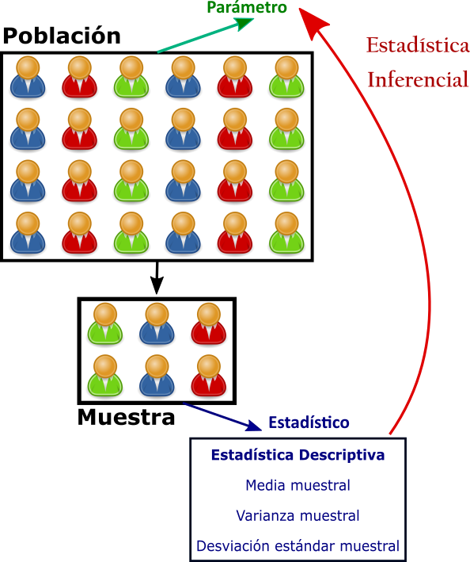
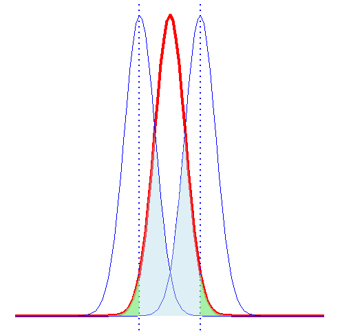

```{r include = FALSE}
if(!knitr:::is_html_output())
{
  knitr::opts_chunk$set(fig.pos = 'h!')
}
```

# Intervalos de Confianza y Pruebas de Hipótesis {#icph}

En la sección \@ref(estypes) se habló de los típos de estadística, la estadística inferencial consiste de los métodos por medio de los cuales se  puede hacer inferencias o generalizaciones sobre una población. En la figura \@ref(fig:infedesc) se ilustra la relación entre la estadística descriptiva y la inferencial. La inferencia estadística se puede dívidir en dos grandes áreas: **estimación** y **pruebas de hipótesis**. 

```{r infedesc, out.width = "55%",fig.cap="Estadista Descriptiva e Inferencial",fig.align = 'center', echo=FALSE,dpi=120,fig.pos = 'h!'}



```

Imaginemos que se desea estimar el promedio de las ventas en miles de las empresas que son auditadas por firmas Big Four, sin embargo debemos recordar que en nuestro conjunto de datos no tenemos a todas las empresas sino a una muestra de las empresas, por lo que afirmar que el valor obtenido es el promedio de todas las empresas auditadas por Big  Four es muy arriesgado. Sin embargo, podríamos dar un intervalo en el que posiblemente se encuentre el valor que deseamos estimar. 

Ahora supongamos que usted como investigador quiere probar que el promedio de las ventas en miles de las empresas que son auditadas por una Big Four es mayor a las empresas que no son auditadas por una Big Four. Una primera aproximación para resolver este problema es realizar una gráfica que le muestre las ventas de acuerdo al tipo de empresa auditora. 

Antes de elaborar el gráfico vamos a crear una nueva variable llamada `Big4`en la que si la variable ``BIG4` es igual a  1 la variable `Big4` tomará el valor de Sí, caso contrario tomará el valor de No. 

```{r}
big4size <- big4size %>%
  mutate(
    Big4 = ifelse(BIG4==1, "Sí","No")
  )
```

En las figuras \@ref(fig:figura6) y \@ref(fig:figura7) se observa el histograma y el diagrama de caja de las ventas de acuerdo a la firma auditora. Al observar las gráficas se puede afirmar que evidentemente el promedio de las ventas de las empresas auditadas por firmas Big Four es mayor, sin embargo en estadística no se puede confirmar o negar una afirmación con solo ver un gráfico.

```{r figura6, echo=TRUE,out.width="70%",fig.cap="Histograma de las Ventas de Acuerdo al tipo de Firma Auditora",fig.pos = 'h!'}

ggplot(big4size, aes(x=VTAS/1000, fill=Big4)) + 
  geom_histogram(alpha=0.3, color="black",bins=10, binwidth = 200000) +
  scale_x_continuous(breaks = seq(0,2000000,200000)) +
  theme(axis.text.x = element_text(angle = 90, hjust = 1)) +
  xlab("Ventas en Miles") + ylab("Frecuencia") 
```

```{r figura7, echo=TRUE,out.width="70%",fig.cap="Diagrama de Caja de las Ventas de Acuerdo al tipo de Firma Auditora",fig.pos = 'h!'}

ggplot(big4size, aes(Big4, VTAS/1000)) + 
  geom_boxplot() + xlab("Tipo de Firma") +
  ylab("Ventas en Miles de Dólares")
```

Los dos problemas citados serán abordados y resueltos en este capítulo. El primero en la sección \@ref(ic) y el segundo en la sección \@ref(ph). 

## Intervalos de Confianza {#ic}

Un *estimador puntual* de un parámetro $\theta$ es un número $\bar{\theta}$ de un estadístico $\Theta$ que puede ser considerado un valor que se aproxima a $\theta$. Por ejemplo $\bar{x}$ del estadístico $\bar{X}$, calculado de una muestra de tamaño $n$ es un estimador puntual del parámetro poblacional $\mu$. Debido a que un estimador puntual es un simple número, no da información por si solo sobre la precisión y la confiabilidad de la estimación. 

En cualquier estimación de un parámetro habrá un error asociado, por ejemplo $\bar{X}$ no debe estimar $\mu$ con exactitud, pero se espera que no esté muy lejos del valor real. Lo que se espera de un estimador es que sea insesgado y eficiente.

La forma de un intervalo de confianza es:

\begin{equation} 
  \text{Estimador puntual} \pm \text{Margen de Error}
  (\#eq:ic)
\end{equation}

El estimador es el valor calculado a partir de la muestra para el parámetro desconocido. El *margen de error* es cuán preciso es nuestro cálculo, basados en la variabilidad del estimador, y de la confianza que tengamos en que el procedimiento detectará el valor real del parámetro de la población. 

### Interpretación de un intervalo de confianza

Un intervalo de confianza del $C \%$ indica que si construimos muchos de esos intervalos, entonces el $C \%$ de las veces el intervalo contendrá el valor real del parámetro. 

Por ejemplo en la figura \@ref(fig:ic) se muestran 100 intervalos construidos con el $95 \%$ de confianza para el promedio poblacional, para construir cada intervalo se tomaron muestras de 100 elementos. Los intervalos de color celeste son los que contienen el valor real del parámetro, los intervalos de color rojo son los que no contienen el valor real del parámetro. El lector puede verificar que $5$ intervalos es decir el $5 \%$ no contiene el valor real del parámetro lo que implica que el $95 \%$ de los intervalos sí contiene el valor real del parámetro.

```{r ic, out.width = "70%",fig.cap="Intervalos de Confianza simulados",fig.align = 'center', echo=FALSE,dpi=120,fig.pos = 'h!'}

knitr::include_graphics("ic.png")

```

### Intervalo de Confianza para la media $\mu$ {#icmu}

Para construir un intervalo de confianza para $\mu$ existen dos casos, el primero es cuando se conoce la desviación poblacional $\sigma$ y el segundo cuando no se conoce la desviación poblacional $\sigma$. El primer caso es hipotético y puede ser considerado un caso para ejemplificar el concepto de intervalo de confianza, en la sección \@ref(jt) se explica en detalle por qué consideramos este un caso hipotético. Para el primer caso usamos la distribución normal y para el segundo debemos usar otra distribución como lo veremos en la sección \@ref(icsd).

#### Intervalo de confianza para $\mu$ cuando se conoce $\sigma$ {#jt}

Si $\bar{x}$ es la media de una muestra aleatoria de tamaño $n$ de una población con desviación conocida $\sigma$, un intervalo con $100\left(1-\alpha\right)\%$ para la media $\mu$ está dado por:

\begin{equation} 
  \left(\bar{x} - Z_{\frac{\alpha}{2}}\dfrac{\sigma}{\sqrt{n}}, \bar{x} + Z_{\frac{\alpha}{2}}\dfrac{\sigma}{\sqrt{n}}  \right)
  (\#eq:icmusc)
\end{equation}

Donde $Z_{\frac{\alpha}{2}}$ es el valor correspondiente a una probabilidad de cola superior de $\frac{\alpha}{2}$ de la distribución normal estándar. El valor de $Z_{\frac{\alpha}{2}}$ que se usa para construir un intervalo de confianza recibe el nombre de *valor crítico*.

Para utilizar la ecuación \@ref(eq:icmusc) es necesario conocer el valor de $\sigma$. Pero conocer $\sigma$ implica conocer todos los valores de la población. Y si se conocen todos los valores de la población se puede calcular el valor de la media poblacional que es lo que nos interesa estimar. En situaciones empresariales y financieras nunca se conoce la desviación estándar de la población y además las poblaciones son muy grandes lo que imposibilita poder examinar todos los valores. En la siguiente sección aprenderemos a abordar esta situación.


#### Intervalo de confianza para $\mu$ cuando no se conoce $\sigma$ {#icsd}

Si $\bar{x}$ es la media de una muestra aleatoria de tamaño $n$ con desviación muestral $s$, un intervalo con $100\left(1-\alpha\right)\%$ para la media $\mu$ está dado por:

\begin{equation} 
  \left(\bar{x} - t_{\frac{\alpha}{2}}\dfrac{s}{\sqrt{n}}, \bar{x} + t_{\frac{\alpha}{2}}\dfrac{s}{\sqrt{n}}  \right)
  (\#eq:icmusd)
\end{equation}

donde $t_{\dfrac{\alpha}{2}}$ es el valor crítico correspondiente a una probabilidad de cola superior de $\dfrac{\alpha}{2}$ de la distribución $t$ con $n-1$ grados de libertad.


### Intervalo de Confianza para la proporción 

Los dos intervalos de confianza vistos en las secciones anteriores son usados para variables cuantitativas, también se puede crear intervalos de confianza para variables categóricas. Por ejemplo, es posible que queramos estimar la proporción de elementos en una población que poseen cierta propiedad de interés. El parámetro de la proporción poblacional lo vamos a representar con la letra griega $\pi$. El estimador puntual para $\pi$ es la proporción muestral $p=\frac{X}{n}$, donde $n$ es el tamaño muestral y $X$ es el número de elementos de la muestra que poseen la catacterística que interesa. 


\begin{equation} 
  \left(p - Z_{\frac{\alpha}{2}}\sqrt{\dfrac{p\left(1-p\right)}{n}}, p + Z_{\frac{\alpha}{2}}\sqrt{\dfrac{p\left(1-p\right)}{n}}  \right)
  (\#eq:icprop)
\end{equation}

Donde

* $p=\text{proporción muestral}=\dfrac{X}{n} =\dfrac{\text{Número de elementos con la característica}}{\text{Tamaño muestral}}$

* $n= \text{ tamaño muestral}$

### Intervalo de Confianza para la diferencia de medias

Si tenemos dos poblaciones con media $\mu_1$ y $\mu_2$ y desviaciones $\sigma_1$ y $\sigma_2$ respectivamente un estimador puntual de la diferencia entre $\mu_1$ y $\mu_2$ viene dado por el estadístico $\bar{X_1}-\bar{X_2}$. Es decir que para obtener un estimador puntual de $\mu_1-\mu_2$ debemos escoger dos muestras independientes, una muestra de cada población, de tamaños $n_1$ y $n_2$. 

De acuerdo al teorema del límite central $\bar{X_1}-\bar{X_2}$ debe estar distribuida normalmente con media $\mu_1 - \mu_2$ y desviación $\sqrt{\dfrac{\sigma_1^2}{n_1} + \dfrac{\sigma_2^2}{n_2}}$.

#### Desviaciones conocidas

Si $\bar{x_1}$ y $\bar{x_2}$ son medias de muestras aleatorias independientes de tamaños $n_1$ y $n_2$ de poblaciones con desviaciones conocidas $\sigma_1$ y $\sigma_2$, respectivamente, un intervalo de confianza al $100\left(1-\alpha\right)\%$ para $\mu_1-\mu_2$ está dado por:

\begin{equation} 
\left( \left( \bar{x}_1 - \bar{x}_2 \right) - z_{\frac{\alpha}{2}}\sqrt{\dfrac{\sigma_1^2}{n_1} + \dfrac{\sigma_2^2}{n_2}} , \left( \bar{x}_1 - \bar{x}_2 \right) + z_{\frac{\alpha}{2}}\sqrt{\dfrac{\sigma_1^2}{n_1} + \dfrac{\sigma_2^2}{n_2}} \right) 
(\#eq:ic2msc)
\end{equation}

#### Desviaciones desconocidas e iguales

Si $\bar{x}_1$ y $\bar{x}_2$ son las medias de muestras aleatorias independientes, de tamaños muestrales $n_1$ y $n_2$ respectivamente, de poblaciones aproximadamente normales con desviaciones desconocidas pero iguales un intervalo de confianza del $100\left(1-\alpha \right)\%$ para $\mu_1 - \mu_2$ está dado por

\begin{equation} 
\left( \left( \bar{x}_1 - \bar{x}_2 \right) - t_{\frac{\alpha}{2}}s_p\sqrt{\dfrac{1}{n_1} + \dfrac{1}{n_2}} , \left( \bar{x}_1 - \bar{x}_2 \right) + t_{\frac{\alpha}{2}}s_p\sqrt{\dfrac{1}{n_1} + \dfrac{1}{n_2}} \right) 
(\#eq:ic2msd)
\end{equation}

donde $s_p$ es el estimador de la desviación conjunta y se calcula a partir de la expresión \@ref(eq:sp) y $t_{\frac{\alpha}{2}}$ es el valor $t$ con $v=n_1+n_2-2$ grados de libertad, con una probabilidad de $\frac{\alpha}{2}$. dejando un área de $\frac{\alpha}{2}$ a la derecha.

\begin{equation} 
s_p^2 = \dfrac{\left(n_1 - 1 \right)s_1^2+\left(n_2 - 1 \right)s_2^2}{n_1 +n_2 -2} 
(\#eq:sp)
\end{equation}

#### Desviaciones desconocidas y diferentes

Si $\bar{x}_1$, $s_1$, $\bar{x}_2$ y $s_2$ son las medias y desviaciones de muestras aleatorias independientes de tamaños muestrales $n_1$ y $n_2$, respectivamente de poblaciones aproximadamente normales con varianzas desconocidas y diferentes un intervalo de confianza del $100\left(1-\alpha \right)\%$ para $\mu_1 - \mu_2$ está dado por:

\begin{equation} 
\left( \left( \bar{x}_1 - \bar{x}_2 \right) - t_{\frac{\alpha}{2}}\sqrt{\dfrac{s_1^2}{n_1} + \dfrac{s_2^2}{n_2}} , \left( \bar{x}_1 - \bar{x}_2 \right) + t_{\frac{\alpha}{2}}\sqrt{\dfrac{s_1^2}{n_1} + \dfrac{s_2^2}{n_2}} \right) 
(\#eq:ic2msdd)
\end{equation}

donde $t_{\frac{\alpha}{2}}$ es el valor $t$ con 

\begin{equation} 
v = \left\lfloor\dfrac{\left(\dfrac{s_1^2}{n_1} + \dfrac{s_2^2}{n_2} \right)^2}{\dfrac{\left( \dfrac{s_1^2}{n_1} \right)^2}{n_1-1}+\dfrac{\left( \dfrac{s_2^2}{n_2} \right)^2}{n_2-1}}\right\rfloor
(\#eq:dfsdd)
\end{equation}

grados de libertad, con un área de $\frac{\alpha}{2}$ a la derecha.


### Intervalo de Confianza para la diferencia de proporciones

Si $p_1$ y $p_2$ son las proporciones de éxitos en muestras aleatorias de tamaño $n_1$ y $n_2$, respectivamente, $q_1 = 1- p_1$, y $q_2 = 1- p_2$ un intervalo de confianza del $100\left(1- \alpha \right)\%$ para la diferencia de dos proporciones poblacionales $\pi_1-\pi_2$, está dado por 

\begin{equation} 
\left( \left( p_1 - p_2 \right) - z_{\frac{\alpha}{2}}\sqrt{\dfrac{p_1q_1}{n_1} + \dfrac{p_2q_2}{n_2}} , \left( p_1 - p_2 \right) + z_{\frac{\alpha}{2}}\sqrt{\dfrac{p_1q_1}{n_1} + \dfrac{p_2q_2}{n_2}}  \right)
(\#eq:icprop2)
\end{equation}


## Pruebas de hipótesis {#ph}

Los intervalos de confianza pueden ayudar a contestar preguntas tales como "¿es razonable concluir que la media de los ingresos de las pequeñas empresas durante el año anterior es igual a medio millón de dólares?" y podrìamos verificar si el valor en cuestión está dentro del intervalo de confianza, de ser así podríamos contestar afirmativamente a la pregunta. Este procedimiento que acabamos de enunciar tiene mucho sentido pero puede resultar "muy débil" para contestar la pregunta. Preguntas como la mencionada anteriormente se pueden contestar usando pruebas de hipótesis. Una hipótesis, en términos estadísticos, es una suposición o afirmación sobre un parámetro de la población y una prueba de hipótesis es un procedimiento basado en evidencia de la muestra y la teoría de la probabilidad para determinar si la hipótesis es una afirmación razonable. 

Toda prueba de hipótesis parte de un enunciado que se asume verdadero hasta probar lo contrario, esta hipótesis que se asume cierta es conocida como __hipótesis nula__. El nombre de _nula_ proviene de la esperanza de que no exista diferencia significativa entre los grupos de prueba. La __hipótesis alternativa__ es lo opuesto a la hipótesis nula. La hipótesis alternativa en la mayoría de los casos se condidera como una hipótesis de investigación.

La hipótesis nula se denota con $H_0$ y la alternativa con $H_1$ aunque algunos autores utilizan la notación $H_a$. Al final de una prueba de hipótesis se acepta o se rechaza la hipótesis nula, pero debemos tener claro que el procedimiento para probar hipótesis incluye la probabilidad de una conclusión incorrecta. Es decir que el investigador debe comprender que el rechazo de una hipótesis implica que la evidencia proporcionada por la muestra es la que rechaza la hipótesis, dicho de otra forma rechazar una hipótesis significa que existe una pequeña probabilidad de obtener la información muestral observada cuando, en realidad la hipótesis es verdadera. 

Existen dos tipos de errores posibles en un procedimiento de prueba de hipótesis: rechazar la hipótesis nula cuando esta es verdadera y no rechazarla cuando esta es falsa, en la  \@ref(tab:err) se resume la relación entre las decisiones y los errores. 


```{r err, echo=FALSE}
filas <- c("$H_0$ es verdadera", "$H_0$ es falsa")
columnas <- c("No rechazar $H_0$","Rechazar $H_0$")

c1 <- c("Decisión Correcta","*Error Tipo I*")
c2 <- c("*Error tipo II*", "Decisión Correcta")
dt <- cbind(c1,c2)
colnames(dt) <- filas
rownames(dt) <- columnas

kable(dt, booktabs = T, caption = "Error tipo I y II",format = "pandoc")
```


El error de tipo I también se conoce como falso positivo y el error de tipo II como falso negativo. La probabilidad de cometer un error de tipo I se denota con $\alpha$ y la probabilidad de cometer un error de tipo II se denota con $\beta$.

Existen algunas propiedades importantes que se deben conocer sobre los errores de tipo I y tipo II. 

* Los errores de tipo I y de tipo II están relacionados. Si la probabilidad de uno aumenta la probabilidad del otro disminuye. 
* La probabilidad de cometer un error de tipo I se puede reducir ajustando el o los valores críticos.
* Un incremento del tamaño muestral $n$, reducirá $\alpha$ y $\beta$.
* Si la hipótesis nula es falsa, $\beta$ tiene un máximo cuando el verdadero valor de un parámetro se aproxima al valor hipotético. A mayor distancia
entre el verdadero valor y el hipotético, el valor de $\beta$ sera menor.

Si se establece una buena regla de decisión, tendríamos una alta oportunidad de tomar una decisión correcta. Desafortunadamente no es posible eliminar completamente la posibilidad de errores, pues como se dijo anteriormente reducir la probabilidad de cometer el error de un tipo implica aumentar el error de otro tipo.

Retomemos la pregunta planteada al inicio de esta sección, tomemos como hipótesis nula que la media es igual a $500000$ y como alternativa que la media es diferente de $500000$, por el momento no entraremos en detalles de como escoger las hipótesis; las hipótesis serán expresadas en miles de dólares:


\begin{equation} 
\begin{cases} 
H_0: \mu = 500 \\ 
H_1: \mu \neq 500
\end{cases} 
\end{equation}


Una *regla de decisión* podría ser escoger un punto o puntos límites en el eje $x$´como en la figura \@ref(fig:pht). La gráfica de color rojo representa $H_0$ y las de color celeste representan $H_1$. En este caso vamos a escoger dos puntos límites porque si la media muestral se encuentra a la izquierda o a la derecha de estos límites, se rechaza $H_0$. En cualquiera de los dos casos la media muestral está demasiado lejos de $H_0$ para ser creíble. Si la media muestral $\bar{x}$ está entre los valores límite se acepta $H_0$. La región entre los puntos límite es la *región de no rechazo* y hacía la izquierda o derecha de los puntos límite se encuentra la *región de rechazo*.

```{r pht, out.width = "60%",fig.cap="Errores Tipo I y II",fig.align = 'center', echo=FALSE,fig.pos = 'h!'}



```

Partiendo de lo anterior, se pueden ver los errores de tipo I y II. El área de color verde bajo la distribución de $H_0$ muestra la probabilidad de rechazar $H_0$ cuando en realidad es verdadera, es decir un error de tipo I. El área de color celeste bajo la distribución de $H_1$ muestra la probabilidad de no rechazar $H_0$ cuando en realidad es falsa. En una prueba de hipótesis el investigador decide la probabilidad $\alpha$ de un error de tipo I, este valor de $\alpha$ es conocido como la **significancia**. 

Los puntos lìmites son conocidos como **valores críticos**. Un procedimiento muy usado en pruebas de hipótesis es calcular el valor $z$ de la media muestral, conocido como **estadìstico de prueba** y luego comparar el valor crìtico con este estadístico. Podrìamos resumir el procedimiento de prueba de hipótesis en 5 pasos:

1. Determinar las hipótesis nula y alternativa.
2. Escoger la significancia, generalmente se escoge  el $5\%$ o $0.05$.
3. Determinar el estadístico
4. Calcular el valor crítico y establecer la regla de decisión
5. Tomar la decisión.

Una forma sencilla de entender cómo establecer la regla de decisión es ver la hipótesis alternativa. La hipótesis alternativa puede tener los símbolos $<$, $>$ o $\neq$. La región de rechazo de cada una se sombrea de color verde en las figuras \@ref(fig:phless), \@ref(fig:phmore) y \@ref(fig:ph2c) respectivamente, al igual que en la figura \@ref(fig:pht) la distribución de rojo corresponde a $H_0$ y la de azul a $H_1$. Las figuras \@ref(fig:phless) y \@ref(fig:phmore) corresponden a pruebas de hipótesis de **una cola** y la figura \@ref(fig:ph2c) corresponde a una prueba de hipótesis de **dos colas**

```{r phless, out.width = "60%",fig.cap="$H_1:<$",fig.align = 'center', echo=FALSE,fig.pos = 'h!'}

knitr::include_graphics("phless.png")

```

```{r phmore, out.width = "60%",fig.cap="$H_1:>$",fig.align = 'center', echo=FALSE,fig.pos = 'h!'}

knitr::include_graphics("phmore.png")

```

```{r ph2c, out.width = "60%",fig.cap="$H_1:\\neq$",fig.align = 'center', echo=FALSE,fig.pos = 'h!'}

knitr::include_graphics("ph2c.png")

```

### Significancia, tamaño del efecto y potencia de la prueba

Los investigadores generalmente buscan resultados "significativos", es común encontrar en los artículos académicos, investigaciones y reportes expresiones como "los resultados son significativos", "el coeficiente es significativamente diferente de cero". Es importante entender que la palabra "significativo" se usa en términos estadisticos y no en el sentido de *importante* o *relevante*. Es decir que algo puede ser estadisticamente significativo pero no relevante. 

Supongamos que en el ejemplo desarrollado en la sección anterior tenemos una media muestral de 496 y que ese valor nos lleva a rechazar la hipótesis nula. Para nosotros esa diferencia puede no ser relevante, sin embargo esa diferencia es significativa en el sentido estadístico. Es decir que no solo deberíamos interpretar los resultados estadísticos solamente en términos de la significancia sino también considerar el tamaño de la diferencia esto es conocido como el __tamaño del efecto__ y preguntarse si es importante o no. 

Otro concepto relacionado a las probabilidades de error es la **potencia de una prueba** que es la probabilidad de rechazar $H_0$ cuando esta es falsa. Si la prueba fuera de una cola con hipótesis alternativa $>$, la potencia de la prueba viene dada entonces por el área bajo $H_1$ a la derecha de la línea de decisión. 

\begin{equation} 
\text{Potencia de una Prueba}=1-P\left(\text{Error Tipo II}\right)=1-\beta
(\#eq:power)
\end{equation}

```{r power, out.width = "60%",fig.cap="Potencia de una prueba de Hipótesis",fig.align = 'center', echo=FALSE,fig.pos = 'h!'}

knitr::include_graphics("power.png")

```

### El valor $p$ {#pvalor}

El valor $p$ es la probabilidad, calculada suponiendo que la hipótesis nula es cierta, de obtener un valor del estadístico de prueba al menos tan contradictorio para $H_0$ como el valor calculado a partir de la muestra disponible. Dicho de otra forma el valor $p$ es el nivel más bajo de significancia en el que el valor observado del estadístico de prueba es significativo.

El criterio para rechazar $H_0$ utilizando el valor $p$ es, si $p<\alpha$ se rechaza $H_0$. Es un criterio ampliamente usado, sin embargo en los últimos años ha tenido muchas críticas. 

### Estadísticos

Aunque el objetivo de este libro es trabajar con R, es necesario que el lector conozca los estadísticos usados en las diferentes pruebas de hipótesis que se trabajarán en las siguientes secciones, 

```{r estadisticos, echo=FALSE}
columnas <- c("Parámetro","Muestra","Varianza(S)","Estadístico","Distribución")

c1 <- c(rep("Media",2),rep("Diferencia de Medias",3),"Proporción","Diferencia de proporciones")
c2 <- c("Grande", "Pequeña","Grande",rep("Pequeña",2),"No aplica","No apica")
c3 <- c("Conocida","Desconocidas","Conocidas","Desconocidas e iguales","Desconocidas y diferentes","No aplica","No aplica")
c4 <- c('$\\dfrac{\\bar{x}-\\mu_0}{\\dfrac{\\sigma}{\\sqrt{n}}}$','$\\dfrac{\\bar{x}-\\mu_0}{\\dfrac{s}{\\sqrt{n}}}$','$\\dfrac{\\left( \\bar{X}_1-\\bar{X}_2 \\right)- \\left(\\mu_1 - \\mu_2 \\right)}{\\sqrt{\\frac{\\sigma_1}{n_1}+ \\frac{\\sigma_2}{n_2} }}$','$\\dfrac{\\left( \\bar{X}_1-\\bar{X}_2 \\right)- \\left(\\mu_1 - \\mu_2 \\right)}{s_p\\sqrt{\\frac{1}{n_1}+ \\frac{1}{n_2} }}$','$\\dfrac{\\left(\\bar{X}_1-\\bar{X}_2 \\right)- \\left(\\mu_1 - \\mu_2 \\right)}{\\sqrt{\\frac{s^2_1}{n_1}+ \\frac{s_2^2}{n_2} }}$','$\\dfrac{p-\\pi}{\\sqrt{\\frac{\\pi\\left(1-\\pi\\right)}{n}}}$','$\\dfrac{p_1-p_2}{\\sqrt{\\hat{p}\\hat{q}\\left(\\frac{1}{n_1}+\\frac{1}{n_2}\\right)}}$')
c5 <- c("$Z$","$t$","$Z$","$t$","$t$","$Z$","$Z$") 
dt <- cbind(c1,c2,c3,c4,c5)
colnames(dt) <- columnas
kable(dt, booktabs = T, caption = "Estadísticos",format = "pandoc")
```

\newpage

## Intervalos de confianza en R

### Para la media

Recapitulando lo revisado en las secciones \@ref(jt) y \@ref(icsd) se definieron los intervalos de confianza para la media con $\sigma$ conocida y desconocida respectivamente. Como se mencionó antes el primer caso es un caso hipotético que sirve como una primera aproximación al concepto y la definición de intervalo de confianza. Mientras que el segundo caso es el escenario con el que frecuentemente se encuentra un investigador o un analista. 

Para el primer caso `R` no tiene una función definida en su instalación base, a manera de ejemplo vamos a hacer algunas suposiciones para construir intervalos de confianza con la distribución normal. El paquete `BSDA` tiene la función `z-test( )` que también será utilizada. Mientras que para el segundo caso se tiene la función `t.test`, que como el lector ha de suponer tiene como objetivo principal realizar pruebas de hipóresis utilizando la distribución $t$  de Student. Esta función además permite obtener intervalos de confianza.

En las dos subsecciones a continuación se trabajará con la variable `ACTIVOS` de las microempresas de la base de datos `Ranking2018Comercio.csv` 

#### $\sigma$ conocida {#musc}

En la ecuación \@ref(eq:icmusc) se define el intervalo de confianza para la media cuando se conoce $\sigma$. Para construir el intervalo supondremos que la desviación de los datos es la desviación poblacional. Recalcamos que esta suposición la hacemos solo para efectos prácticos. 

Primero cargamos los datos y seleccionamos solo los valores con los que deseamos trabajar. Usamos la función `filter( )` para seleccionar las observaciones que cumplen con la condición de que el tamaño de la empresa sea microempresa. Y luego seleccionamos solo la variable que analizaremos con la función `select( )`, en este caso solo escogemos la variable `ACTIVO`. Al finalizar la operación de filtro y selección usamos la función `attach( )`, el argumento que se escribe en la función es el nombre del conjunto de datos. La función `attach` sirve para cargar los datos a la memoria, la principal ventaja de usarla es que cuando los datos se cargan a la memoria no debemos usar el operador `$` por ejemplo en vez de escribir `dataframe$variable` ahora solo escribiremos `variable`. 


```{r include=TRUE, eval=FALSE, results='hide'}

rank18com = read.csv("Ranking2018Comercio.csv",header=TRUE, 
                     dec=",", sep=";")

rank18com.Micro = rank18com %>%
  filter(TAMA == "MICROEMPRESA") %>%
  select(ACTIVO)

attach(rank18com.Micro)

```

```{r include=FALSE, eval=TRUE,  results='hide'}

rank18com = read.csv("Ranking2018Comercio.csv",header=TRUE, 
                     dec=",", sep=";")

rank18com.Micro <- rank18com[which(rank18com$TAMA == "MICROEMPRESA"), ]

rank18com.Micro = rank18com %>% 
  select(ACTIVO)

attach(rank18com.Micro)


```

Vamos a calcular la media y la desviación de los activos de las microempresas.

```{r, echo=TRUE}

media = mean(ACTIVO)
desviacion = sd(ACTIVO)
```

Vamos ahora a calcular el término $Z_{\frac{\alpha}{2}}\dfrac{\sigma}{\sqrt{n}}$ para calcular el término $Z_{\frac{\alpha}{2}}$ trabajamos con la función `qnorm` el argumento que escribimos en la función es el valor $1-\frac{\alpha}{2}$, si el intervalo es con el $95\%$ de confianza $\alpha=0.05$ por lo que el valor a ser escrito en la función es $1-\frac{0.05}{2}=0.975$. Para calcular $\sqrt{n}$ primero determinamos $n$ con la función `nrow()` el argumento que recibe esta función es el conjunto de datos. Para calcular la raíz utilizamos la función `sqrt( )`.

 
```{r, echo=TRUE}

error  = qnorm(0.975)*desviacion/sqrt(nrow(rank18com.Micro))

```

Ahora calculamos los extremos del intervalo:

```{r, echo=TRUE, collapse = TRUE}

menor = media - error
mayor = media + error
menor
mayor

```

El intervalo con el $95\%$ de confianza para la media es $\left( 198886.20, 492255.30 \right)$. Si quisieramos calcular el intervalo con el $98\%$ de confianza cambiamos el argumento en la función `qnorm()` de $0.975$ a $0.99$.


```{r, echo=TRUE, collapse=TRUE}

error  = qnorm(0.99)*desviacion/sqrt(nrow(rank18com.Micro))
menor = media - error
mayor = media + error
menor
mayor

```

El intervalo con el $98\%$ de confianza para la media es $\left( 171465.80, 519675.70 \right)$.

Otra opción si no se desea programar todos los pasos es usar la función `z.test` del paquete `BSDA` en la función `z.test()` se debe indicar el valor de $\sigma$ en este caso, como antes, asumiremos que $\sigma$ es la desviación de los activos obtenida con anterioridad. Ya que solo nos interesa calcular el intervalo de confianza usaremos `z.test()$conf.int` que nos dará el intervalo con un $95\%$ de confianza:

```{r, echo=TRUE, collapse=TRUE}
library(BSDA)
z.test(ACTIVO,sigma.x = desviacion)$conf.int
```

Si deseamos calcular el intervalo con un nivel de confianza diferente al $95\%$, por ejemplo el $98\%$, indicamos la opción `conf.level=0.98`

```{r, echo=TRUE, collapse=TRUE}
z.test(ACTIVO,sigma.x = desviacion, conf.level = 0.98)$conf.int
```

#### $\sigma$ desconocida {#musd}

La función `t.test()` se utiliza para realizar pruebas de hipótesis, sin embargo entre sus salidas o resultados se encuenta un intervalo de confianza, debido a que solo nos interesa calcular intervalos de confianza utilizaremos la instrucción `t.test()$conf.int` que nos dará directamente el intervalo con un $95\%$ de confianza:

```{r, echo=TRUE, collapse=TRUE}

t.test(ACTIVO)$conf.int

```

Si deseamos calcular el intervalo con otro nivel de confianza, por ejemplo el $90\%$, agregamos dentro de la función `t.test()` la opción `conf.level = 0.90`

```{r, echo=TRUE, collapse=TRUE}

t.test(ACTIVO, conf.level = 0.90 )$conf.int

```

Para terminar esta sección vamos a liberar la memoria de los datos `rank18com.Micro` para esto usamos la función `detach`

```{r, echo = TRUE}
detach(rank18com.Micro)
```

### Para la proporción

Para estimar intervalos de confianza para la proporción se utiliza la función `prop.test(x, n, conf.level = 0.95, correct = TRUE)$conf.int`. En `x` se escribe el número de éxitos y en `n` el número de intentos. 

Supongamoos que deseamos calcular un intervalo de confianza para la proporción de empresas grandes de la base de datos `Ranking2018Comercio.csv`. 

Primero cargamos los datos y determinamos el número de empresas en total dentro de la base de datos con el comando `nrow()`, mientras que para contar el número de empresas que son grandes usamos también el comando `nrow()` pero lo aplicamos a un subconjunto de los datos este subconjunto lo construimos con `rank18com[which(rank18com$TAMAÑO=='GRANDE', )]`. Nótese que dentro del nombre del conjunto de datos ponemos la condición de que el tamaño sea `"GRANDE"`

```{r include=TRUE, results='hide'}

rank18com = read.csv("Ranking2018Comercio.csv",header=TRUE, 
                     dec=",", sep=";")

x = nrow(rank18com[which(rank18com$TAMA == "GRANDE"), ])
n = nrow(rank18com)

```

Para construir un intervalo de confianza para la proporción se utiliza la función `prop.test()`, esta función utiliza los argumentos básicos `prop.test(x,n,conf.level=0.95)$conf.int`, `x` y `n` están definidos como anteriormente lo hacíamos para la proporción.

Construyendo el intervalo de confianza con el 95%  de confianza para la proporción de empresas grandes se obtiene

```{r include=TRUE}

prop.test(x,n)$conf.int
```

Es decir que la proporción de empresas grandes dedicadas al comercio se encuentra en el intervalo $\left(0.0114, 0.0396 \right)$

### Diferencia de medias

#### $\sigma_1$ y $\sigma_2$ conocidas

Para esta sección necesitamos dos grupos el grupo 1 serán las pequeñas empresas y el grupo 2 las microempresas, 

```{r include = TRUE, eval=FALSE, results='hide'}
rank18com.Peq = rank18com %>%
  filter(TAMA == "PEQUEÑA") %>%
  select(ACTIVO)
act.Peq = rank18com.Peq$ACTIVO

rank18com.Micro = rank18com %>%
  filter(TAMA == "MICROEMPRESA") %>%
  select(ACTIVO)
act.Micro = rank18com.Micro$ACTIVO
```

```{r include = FALSE, eval = TRUE, results='hide'}

rank18com.Peq = rank18com[which(rank18com$TAMA == "PEQUEÑA"), ]
 
rank18com.Peq = rank18com.Peq %>%
  select(ACTIVO)

act.Peq = rank18com.Peq$ACTIVO

rank18com.Micro = rank18com[which(rank18com$TAMA == "MICROEMPRESA"), ]
rank18com.Micro = rank18com.Micro %>%
  select(ACTIVO)

act.Micro = rank18com.Micro$ACTIVO
```

Vamos a elaborar el intervalo de confianza para la diferencia de medias de los dos grupos $\mu_1-\mu_2$. Esto lo vamos a hacer con la función `z.test` del paquete `BSDA`. En la sección \@ref(musc) utilizamos la función para elaborar el intervalo de confianza. En extenso esta función se usa de la siguiente forma `z.test(x, y = NULL, alternative = "two.sided", mu = 0, sigma.x = NULL,
  sigma.y = NULL, conf.level = 0.95)` Como podemos ver por defecto el programa calcula el intervalo de confianza con un $95\%$ de confianza. Además debemos indicar los valores de $\sigma_1$ y $\sigma_2$ y al igual que en la seccion \@ref(musc) supondremos que la desviación muestral es la desviación poblacional. Vamos a calcular el intervalo de confianza para la diferencia de medias con el $95$% de confianza. 

```{r echo=TRUE}
library(BSDA)
z.test(x=act.Peq, sigma.x = sd(act.Peq), 
       y=act.Micro, sigma.y = sd(act.Micro))$conf.int
```

Vamos ahora a modficar el parámetro de la confianza y trabajamos con un nivel de $90\%$ de confianza.

```{r echo=TRUE}
library(BSDA)
z.test(x=act.Peq, sigma.x = sd(act.Peq), 
       y=act.Micro, sigma.y = sd(act.Micro), 
       conf.level = 0.90)$conf.int
```


#### Desviaciones desconocidas y diferentes {#icddd}

Para esta sección y la siguiente vamos a trabajar con las mismas variables de la sección anterior. Como en la sección \@ref(musd) vamos a trabajar con la función `t.test` el uso de esta función es `t.test(x, y = NULL,alternative = c("two.sided", "less", "greater"),mu = 0, paired = FALSE, var.equal = FALSE,conf.level = 0.95, ...)` La función por defecto calcula el intervalo con el $95$% de confianza y se asume que las desviaciones son diferentes. 

Vamos a trabajar ahora con un intervalo de confianza al $95$% para la diferencia de medias con desviaciones desconocidas y diferentes. Aunque por defecto la función asume que las desviaciones son diferentes incluimos la opción `var.equal = FALSE`. 

```{r echo=TRUE}
t.test(x=act.Peq, y=act.Micro, var.equal = FALSE,
       conf.level = 0.95)$conf.int
```

Si calculamos el intervalo ahora con el $98$% de confianza.

```{r echo=TRUE}
t.test(x=act.Peq, y=act.Micro, var.equal = FALSE,
       conf.level = 0.98)$conf.int
```


#### Desviaciones desconocidas e iguales

Cuando se asumen desviaciones iguales se usa la opción `var.equal = TRUE`. El intervalo de confianza con el $95$% se calcula de la siguiente forma:

```{r echo=TRUE}
t.test(x=act.Peq, y=act.Micro, var.equal = TRUE,
       conf.level = 0.95)$conf.int
```

Mientras que el intervalo con el $98$% seria:

```{r echo=TRUE}
t.test(x=act.Peq, y=act.Micro, var.equal = TRUE,
       conf.level = 0.98)$conf.int
```

### Diferencia de proporciones

Para ejemplificar esto vamos a construir el intervalo de confianza para la diferencia de proporciones de microempresas y pequeñas empresas. Vamos a obtener primero los valores de $x_1$, $x_2$, $n_1$y $n_2$, en este caso como trabajaremos con los datos de la base `Ranking2018Comercio.csv` los valores de $n_1$ y $n_2$ son iguales

```{r echo=TRUE}
n = nrow(rank18com)
x1 = length(act.Micro)
x2 = length(act.Peq)
```

Construimos ahora el intervalo para la diferencia de las proporciones con un 95% de confianza.

```{r include=TRUE}

prop.test(c(x1,x2),c(n,n))$conf.int
```

Construimos ahora el intervalo para la diferencia de las proporciones con un 99% de confianza.

```{r include=TRUE}

prop.test(c(x1,x2),c(n,n), conf.level = 0.99)$conf.int
```

## Pruebas de Hipótesis en R

### Para la media 


En este caso vamos a usar la función `z.test()` o `t.test()`  dependiendo si la o las desviaciones son conocidas o desconocidas respectivamente.

#### $\sigma$ conocida

El uso de la función `z.test` es `z.test(x, y = NULL,alternative = "two.sided", mu = 0, sigma.x = NULL,sigma.y = NULL, conf.level = 0.95)` para pruebas de hipótesis de una sola variable solo ingresamos la variable a ser analizada en `x`,  para indicar la hipótesis alternativa en la opción `alternative` podemos escribir `"greater"`para mayor, ``"less"`` para menor o `"two.sided"` para diferente. Como antes debemos indicar el valor de la desviación conocida que asumiremos también que es la desviación de la muestra.
Para indicar el valor hipotético de la media reemplazamos en la opción `mu=0` el valor de $0$ por el valor hipotético.

Para ejemplificar el uso de la función, supongamos que queremos verificar si la media del valor de los activos de las microempresas dedicadas al comercio es diferente de $40\;000$, con una significancia del $5\%$, cuando hacemos la prueba de hipótesis debemos indicar la confianza que es el complemento de la significancia $\text{Confianza}=1- \text{Significancia} \rightarrow \text{Significancia}=1-\text{Confianza}$.   

La hipótesis nula y alternativa serían:

\begin{equation} 
\begin{cases} 
H_0: \mu = 40\;000 \\ 
H_1: \mu \neq 40\;000
\end{cases} 
\end{equation}

La instrucción en R para hacer la prueba de hipótesis sería:

```{r, echo=TRUE}
desviacion = sd(act.Micro)
z.test(act.Micro, mu = 40000, sigma.x = desviacion, conf.level = 0.95)
```

En este caso el valor $p$ (`p-value`) es igual a $0.8274$ y recordemos que en la sección \@ref(pvalor) se definió el criterio del valor $p$ que consiste en rechazar $H_0$ cuando $p < \alpha$. En este caso se acepta la hipótesis nula de que el valor real de la media es igual a $40\;000$.

Supongamos ahora que se desea probar que el valor real de la media es menor a $40\;000$, para hacer esto incluimos la opción `alternative ="less"`.

```{r, echo=TRUE}
z.test(act.Micro, mu = 40000, sigma.x = desviacion,alternative = "less",  conf.level = 0.95)
```

Las conclusiones son parecidas a la primera prueba de hipótesis realizada. Para finalizar liberamos la memoria del conjunto de datos.


#### $\sigma$ desconocida

Cuando se desconoce el valor de $\sigma$ se utiliza la función `t.test( )` que se asemeja a la función `z.test( )` con la diferencia que no se debe proporcionar el valor teórico de $\sigma$. 

Para comprender el uso de esta función para realizar pruebas de hipótesis vamos a trabajar con los activos de empresas pequeñas. Estamos interesados en conocer si el valor promedio de los activos de las empresas pequeñas es mayor a $250\;000$. Las hipótesis nula y alternativa se muestran a continuación. 


\begin{equation} 
\begin{cases} 
H_0: \mu \leq 250\;000 \\ 
H_1: \mu > 250\;000
\end{cases} 
\end{equation}


Realizamos ahora la prueba de hipótesis con una significancia ($\alpha$) del $5\%$ es decir una confianza del $95\%$:

```{r, echo=TRUE}
t.test(act.Peq, mu = 250000,alternative = "greater",  conf.level = 0.95)
```

De acuerdo a los resultados obtenidos, el valor $p$ nos sugiere no rechazar la hipótesis nula es decir que la media poblacional de los activos de las empresas pequeñas es menor o igual a $250\;000$

### Para la proporción

Supongamos que se quiere probar que más de la mitad de las compañías son microempresas. Es decir en términos matemáticos se afirma que la proporción de compañías catalogadas como microempresas es mayor a $0.50$. Las hipótesis nula y alternativa serían:

\begin{equation} 
\begin{cases} 
H_0: \pi \leq 0.50 \\ 
H_1: \pi > 0.50
\end{cases} 
\end{equation}

Para realizar pruebas de hipótesis para la proporción utilizamos la función `prop.test()`, con respecto a los intervalos de confianza agregamos las opciones: 

* `p = NULL` donde indicamos el valor de la proporción hipotética y 
* `alternative = c("two.sided", "less", "greater")` para señalar la hipotésis alternativa.

La prueba de hipótesis con una significancia del $5\%$ es decir una confianza del $95$%, en `n` almacenamos el total de datos y en `x1` el total de microempresas:

```{r, echo=TRUE}
n = nrow(rank18com)
x1 = length(act.Micro)
prop.test(x1, n, p = 0.50, alternative = "greater",  conf.level = 0.95)
```

De acuerdo al valor $p$ obtenido se concluye que hay suficiente evidencia estadística para rechazar la hipótesis nula, es decir que más de la mitad de las compañías es catalogada como microempresa. 

Ahora, imaginemos que deseamos probar la hipótesis de que el porcentaje de empresas catalogadas como pequeñas es menor al 25%, esta hipótesis se desea probar con una significancia del 2%. Las hipótesis nula y alternativa serían ahora.

\begin{equation} 
\begin{cases} 
H_0: \pi \geq 0.25 \\ 
H_1: \pi < 0.25
\end{cases} 
\end{equation}

Para realizar la prueba de hipótesis en R, en la opción `alternative` sería `"less"` y `p` debemos configurarlo como `p=0.25` el nivel de confianza sería 98%

```{r, echo=TRUE}
n = nrow(rank18com)
x2 = length(act.Peq)
prop.test(x2, n, p = 0.25, alternative = "less",  conf.level = 0.98)
```

De acuerdo al valor $p$ obtenido se concluye que hay suficiente evidencia estadística para no rechazar la hipótesis nula. Es decir que la proporción de compañías catalogadas como pequeñas es mayor o igual a $0.25$

### Para la diferencia de medias

#### $\sigma_1$ y $\sigma_2$ conocidas

Supongamos que se desea probar que el promedio de los activos de las empresas pequeñas es mayor que el promedio de los activos de las microempresas y se asume que se conocen las desviaciones poblacionales. Como ya sabemos esta prueba se realiza con la función `z.test( )`. Vamos a establecer que las empresas pequeñas son el grupo 1 y las microempresas el grupo 2. Las hipótesis nula y alternativa serían. 

\begin{equation} 
\begin{cases} 
H_0: \mu_1 \leq \mu_2 \\ 
H_1: \mu_1 > \mu_2
\end{cases} 
\end{equation}


Realizamos ahora la prueba de hipótesis con un $90\%$ de confianza

```{r, echo=TRUE}
z.test(x=act.Peq, sigma.x = sd(act.Peq), 
       y=act.Micro, sigma.y = sd(act.Micro),
       alternative = "greater", conf.level = 0.90)
```

Por el valor $p$ obtenido se rechaza la hipótesis nula es decir que el promedio de los activos de las empresas pequeñas es mayor al promedio de los activos de las microempresas. 

#### $\sigma_1$ y $\sigma_2$ desconocidas y diferentes

En este caso vamos a trabajar con los mismos datos de la sección anterior. Se desea probar ahora con una significancia del $5\%$ y asumiendo que las desviaciones son diferentes que las medias de los activos de las empresas pequeñas es igual al promedio de los activos de las microempresas. La hipótesis nula y alternativa en este caso serían:

\begin{equation} 
\begin{cases} 
H_0: \mu_1 = \mu_2 \\ 
H_1: \mu_1 \neq \mu_2
\end{cases} 
\end{equation}


```{r echo=TRUE}
t.test(x=act.Peq, y=act.Micro, var.equal = FALSE,
       conf.level = 0.95)
```

De acuerdo al valor $p$ obtenido se concluye que hay suficiente evidencia estadística para rechazar $H_0$ es decir que el promedio de los activos de las empresas pequeñas es diferente al promedio de los activos de las microempresas.


#### $\sigma_1$ y $\sigma_2$ desconocidas e iguales

A diferencia de la sección anterior se debe añadir en la función `t.test()` la opción `var.equal=TRUE`. Para ejemplificar el uso de la función con la opción indicada, la prueba de hipótesis será igual que en la sección anterior es decir que las hipótesis nula y alternativa son:

\begin{equation} 
\begin{cases} 
H_0: \mu_1 = \mu_2 \\ 
H_1: \mu_1 \neq \mu_2
\end{cases} 
\end{equation}

```{r echo=TRUE}
t.test(x=act.Peq, y=act.Micro, var.equal = TRUE,
       conf.level = 0.95)
```

De acuerdo al valor $p$ obtenido, las conclusiones son iguales a cuando se asumen las desviaciones diferentes. Es decir que se rechaza la hipótesis nula de igualdad de los promedios de los activos de las empresas pequeñas y microempresas, hay suficiente evidencia estadística para concluir que las medias de los activos son diferentes.

### Para la diferencia de proporciones


\newpage

## Ejercicios